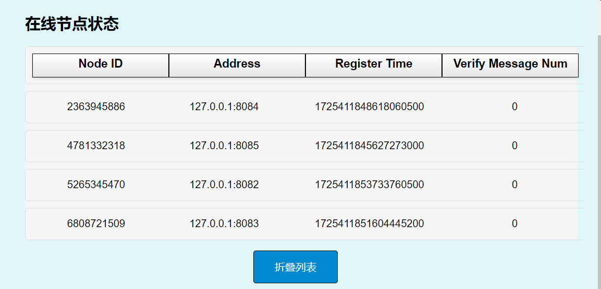

# 农产追溯通
## 应用背景
在当今社会，农产品质量安全问题备受关注。随着人们生活水平的提高，对农产品的品质和安全性要求越来越高。然而，传统的农产品供应链存在诸多问题，如信息不对称、数据易篡改、追溯困难等，这些问题严重影响了消费者对农产品的信任。


区块链具有去中心化、不可篡改、可追溯等特性，能够为农产品溯源提供新的解决方案。近年来，区块链技术在各个领域得到了广泛的应用，但其在农产品溯源领域的应用仍处于初级阶段，可以进一步深入研究和探索。

## 拟解决问题
农产追溯通提出基于多链结合的区块链农产品溯源方案，能够有效地解决传统农产品溯源体系中存在的问题。通过将农产品生产、运输、加工、储存、销售等环节的信息分别存储在侧链上，并在主链上进行索引，可以实现农产品信息的全程追溯，提高农产品溯源的准确性和可信度。这有助于保障消费者的权益，增强消费者对农产品的信任。此外，该方案还可以促进农产品供应链各环节的信息共享和协同，提高供应链的效率和透明度，推动农产品产业的健康发展。


## 设计思路和方案
本项目主体可被拆分为区块链，管理系统以及加密模块三大模块，本项目中对于这三个模块的设计如下
### 区块链模块
#### 区块链存储结构设计
区块链的是由一系列链式数据结构组成的分布式账本，每个数据块（区块）包含一定时间内的交易记录。区块按时间顺序依次连接，形成了一条不可篡改的链。区块链网络中的各个节点共同维护账本的一致性，而不需要依赖中心化的机构。本项目中较普通区块链结构进行了优化，提出了多链结合的主侧链结构，按照数据的重要程度以及安全性，在不同的侧链上对数据进行分级存储而仅在主链存储索引。在保证数据存储安全性的同时也大大减小了主链的存储压力，可以适应不同种类农产品信息的记录场景。
```go
//主链存储数据结构设计
type MetaData struct {
	EggplantId      int        `json:"eggplant_id"`
	ProductHeight   int        `json:"product_height"`
	ProductHash     types.Hash `json:"product_hash"`
	TransportHeight int        `json:"transport_height"`
	TransportHash   types.Hash `json:"transport_hash"`
	ProcessHeight   int        `json:"process_height"`
	ProcessHash     types.Hash `json:"process_hash"`
	StorageHeight   int        `json:"storage_height"`
	StorageHash     types.Hash `json:"storage_hash"`
	SellHeight      int        `json:"sell_height"`
	SellHash        types.Hash `json:"sell_hash"`
}
```

#### 区块结构设计
本项目区块结构主要由区块头模块，存储信息模块和验证信息模块组成。区块头中存储了区块的版本，高度等元数据，以及关系到后面选举算法的节点信誉值数据。存储模块中存储了农产品信息，验证模块则主要有 leader 节点信息和leader 节点签名组成
```go
type Header struct {
	Version       int32
	PrevBlockHash types.Hash
	DataHash      types.Hash
	Timestamp     int64
	Height        int32
	Nonce         int64
	Scores        map[int]int
	Leader        int
}


type Block struct {
	*Header
	Eggplants []*Eggplant
	Validator []byte
	Signature []byte
	BlockHash types.Hash
}
```


#### 共识算法设计
共识算法是区块链技术的核心组成部分。它确保了分布式网络中账本的状态达成一致。常见的共识算法包括工作量证明（PoW）、权益证明（PoS）、实用拜占庭容错（PBFT）等。本项目使用信誉监督拜占庭容错（CSBFT）以实现更低的时延和更高的安全性。


同时，本项目以原有 CSBFT 算法为基础，进行了以下优化，旨在提升联盟链的去中心化程度、节点可靠性以及记录安全性：
1. 禁止上一轮的节点参与本轮选择，避免出现联盟链中的中心化和垄断情况。
2. 禁止本轮未参与投票的节点参与领导者选举，以此确保领袖节点在出块附近时期的性能与良好信誉。
3. 对上一轮的得分折半计算，在领袖节点的选举过程中更重视节点在临近出块周期的表现。
4. 随链更新得分记录，确保得分记录的安全性


最后，本项目在信息的传播机制中较传统的 pbft 算法进行了优化，在 prepare 消息环节中引入随机 nonce 以防止恶意节点通过 Prepare 阶段的签名伪造 Commit 签名，具有更高的安全性。


#### 内存池结构设计
在联盟链系统中，当接收到客户端的农产品信息后，会对信息进行校验，将校验通过的信息存入内存池，以待出块操作。内存池采用哈希表来存储信息，能够高效地确保数据上传操作的幂等性。同时，内存池运用先进先出（FIFO）模式对数据进行入池和出池操作，有力地保障了先上传数据在处理上的优先性。
鉴于分布式系统中不同节点处的数据可能存在不一致性，在出块后需要对所有节点的内存池进行同步，以防止后续出现部分数据重复提交的情况。这就要求对内存池能够进行高效的删除操作。本项目通过使用双向链表和哈希索引对 FIFO 通道进行了优化改造。一方面，能够以 O (1) 的时间复杂度快速添加尾部元素和删除头部元素，在上传数据时作为先入先出的通道发挥作用；另一方面，可通过哈希索引实现对重复元素的快速查找。最后，双向链表具有极低的删除成本，与数组不同，无需为了保持内存的连续性而付出巨大的位移开销。


### 联盟链管理系统设计
本系统为联盟链管理系统，所实现的功能主要包括对于联盟链节点的准入校验，客户端节点的准入校验，以及实现联盟链节点与客户端的双向交互。

#### 客户端登陆模块设计
此接口在用户上传登陆信息后会返回数据库进行校验，如果用户在数据库中存在并且密码正确，则返回服务端签名的 jwt token，否则返回报错


#### jwt 校验中间件设计
用户在进行数据上传和数据查询操作之前，服务端首先会对客户端 cookie 中的 token 进行校验，如果存在 token 并且 token 未过期（本项目中设置 token 时效为 24 小时），则可以成功访问，否则会将用户重定向会登陆页面


#### 联盟链状态查询接口
本接口会返回所有注册的联盟链节点 ID 以及其对应 IP，信誉值等信息


#### 农产品数据上传接口
用户在前端页面上传农产品的原始信息，并指定同步信息的节点（本系统中基于普通的 pbft 通信机制进行了优化，在确保安全性的前提下，不限于领袖节点接收农产品信息，任何节点接收信息后都可以全网广播，从而大大分担了传统 pbft 中 leader 的通信压力），管理系统向联盟链发起同步请求，联盟链节点同步通过后会将数据放入内存池，等待出块。


#### 农产品信息查询接口
用户端输入农产品的 ID 并指定查询节点后，后端解析报文并首先在本地 redis 数据库的缓存数据库中查询是否存在相关农产品信息，如果存在则直接返回，如果不存在则会向区块链发起数据更新请求。并在一段时间内持续访问 redis 查询数据是否存在，如果存在则向客户端返回，否则返回该农产品不存在


#### 联盟链元数据接口
本接口用于与联盟链节点的对接，可以接收联盟链的查询结果，当监听到请求后，系统首先监测联盟链节点的签名，签名校验通过后便将信息放入本地缓存，等待客户端查询。
```go
func (c *ChainModel) HandleChainResponse(ctx *gin.Context) {
	metaData := models.MetaData{}
	if err := ctx.ShouldBindJSON(&metaData); err != nil {
		utils.LogMsg([]string{"HandleChainResponse"}, []string{"can not decode metadata err=" + err.Error()})
		return
	}
	if !metaData.Verify() {
		utils.LogMsg([]string{"HandleChainResponse"}, []string{"metadata verify failed"})
		return
	}
	key := strconv.Itoa(metaData.EggplantId)
	byteData, err := json.Marshal(metaData)
	if err != nil {
		utils.LogMsg([]string{"HandleChainResponse"}, []string{"metaData marshal failed err=" + err.Error()})
	}

	res := c.reDB.Db.Set(key, string(byteData), 60*60*time.Second)
	if res.Err() != nil {
		utils.LogMsg([]string{""}, []string{"set key failed err = " + res.Err().Error()})
	}
}

```

### 加密模块设计
#### snark-js
由 JS 和纯 Web As­sem­bly 实现的 zk­SNARK，内部实现了 Groth16、Plonk 和 FFLONK（Beta 版）三个算法
snarkjs 继承了所有协议需要的组件，包括初始可信设置的 NMPC 执行过程（用以计算全局的ττ 的幂）和计算指定电路的证明
snarkjs 基于 nodejs，计算采用 cir­com 编译的电路
snarkjs 采用 ES 模式，可以直接部署到 rollup 或 web­pack 等项目中

本次项目中采用以Groth16算法，bn128曲线为例的snark验证调用

#### Arkwork-rs
arkworks 是一个用于 zkSNARK 编程的 Rust 生态系统。arkworks 生态系统中的库提供了实现 zkSNARK 应用程序所需的所有组件的高效实现，从通用有限域到常见功能的 R1CS 约束。

本次项目中使用arkwork-rs算法库实现了一个plookup隐私保护查询功能，并尝试修改源码制作通用API

#### snark-js 主要流程


#### 加密过程编译


## 实现功能和指标
### 联盟链模块  
#### Eggplant 哈希  
#### 1. 功能  
- 实现了利用 `sha256` 算法对 `eggplant` 对象的快速哈希
#### 2. 指标  
可以在小于 `0.01` 的时间内完成对 `20` 个 `eggplant` 对象的哈希。  

#### Eggplant 二进制编码
#### 1. 功能  
- 使用二进制流的方式实现了对 `eggplant` 对象的快速序列化和反序列化.
#### 2. 指标
- 可以在 `0.01` 秒时间内完成对 `20` 个`eggplant` 对象的序列化与反序列化。

#### Eggplant 二进制编码签名模块
#### 1. 功能  
- 实现了基于 `ECDSA` 算法对于每个 `eggplant` 内容的前面与验证
#### 2. 指标  
- 可以在小于 `0.01` 的时间内完成对 `20` 个 `eggplant` 对象的签名与验证。


### Blockchain模块测试
#### 区块链出块模块测试
#### 1. 功能
- 向区块链中添加区块。
- 保证区块链高度和链长度在添加区块后的正确性。

### 软件流程图  


#### 2. 指标
- 测试了`1000` 个区块的添加与验证测试执行时间为`0.55s`，成功通过测试（`PASS`）。

#### 历史区块查询模块测试
#### 1. 功能
- 实现对于历史区块根据高度的检索  

#### 2. 指标
- 测试`1000`个区块的出块过程，并在出块过程中对每个新出块进行历史区块检索，验证检索到的区块头部信息与原始区块头部信息是否一致。执行时间为`0.53s`，成功通过测试（`PASS`）。

### 加密模块测试
#### 私钥生成模块测试
#### 1. 功能
- 测试生成`1000`个随机密钥对，使用生成的私钥对特定消息进行签名，并使用对应的公钥验证签名的正确性，同时验证对错误消息签名验证失败。

#### 2. 指标
- 测试执行时间为`0.30s`，成功通过测试（`PASS`）。

#### 密钥的本地存储模块
#### 1. 功能
- 用户将公私钥在本地进行持久化存储

#### 2. 指标
- 测试了10个用户私钥的持久化存储，执行时间为`0.11s`，成功通过测试（`PASS`）。

#### 密钥的本地读取模块
#### 1. 功能
- 从用户本地存储中读取公私钥

#### 2. 指标
- 测试了10个用户私钥的读取，执行时间为`0.07s`，成功通过测试（`PASS`）。

#### 签名的编码模块
#### 1. 功能
- 对于签名结果进行二进制编码，方便网络传输。

#### 2. 指标
- 连续生成`1000`个随机签名，对每个签名进行编码后再解码，并验证解码后的签名与原始签名一致，且使用公钥验证签名对原始数据验证成功。测试执行时间为`0.21s`，成功通过测试（`PASS`）。

### 内存池模块测试
#### 内存池并发添加数据能力测试
#### 1. 功能
- 在网络实时环境中，并发接收来自其他节点的农产品数据，并且进行添加。

#### 2. 指标
- 向内存池并发添加`500`条数据，每条数据包含`eggplant`相关信息（`MetaData`），生成私钥对`eggplant`的哈希进行签名，并设置相关时间戳后添加到内存池。测试执行时间为`0.10s`，成功通过测试（`PASS`）。

#### 内存池索引模块能力测试
#### 1. 功能
- 通过 eggplantId 实现对于内存池中存储产品的快速索引

#### 2. 指标
- 向内存池先后插入`500`条数据，并根据数据的哈希对数据进行索引，验证通过哈希索引到的数据与原始插入数据的一致性（包括`EggplantId`和整个数据对象）。测试执行时间为`0.10s`，成功通过测试（`PASS`）。

#### 内存池删除模块能力测试
#### 1. 功能
- 在维护内存池先入先出通道的同时，实现对某个 eggplant 的快速定位与删除

#### 2. 指标
- 向内存池中添加`500`条随机数据，根据数据的`EggplantId`满足`%3 == 0`的条件删除数据，最后验证内存池中剩余数据是否符合预期（即不存在`EggplantId %3 == 0`的数据）。测试执行时间为`0.09s`，成功通过测试（`PASS`）。

## 软件流程图


## 程序容器化部署
1. 进入controller_system 文件夹下，打包 docker 镜像  
```shell
docker build -t control_system .
```
2. 使用 docker-compose 启动mysql，redis 数据库和后端程序  
```shell
docker-compose up -d
```
3. 进入 trace_of_product 打包节点镜像文件
```shell
docker build -t node .
```
4. 启动联盟链节点  
```shell
docker run --name=node1 --network trace_of_product -e IP=node1 -e NODE_NAME=node1 -id node
```  
如果只是想要自建一个简单的区域联盟链网络，本项目提供了一个四节点的联盟链网路启动脚本，可以执行下面操作启动  
```shell
./quick-start.sh
```  
5. 进入 front-end ,打包前端镜像
```shell
docker build -t front-end .
```

6. 启动前端容器
```shell
docker run --name=menu -p 8880:80 --network trace_of_product -id front-end
```