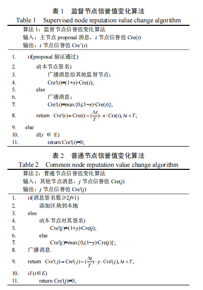
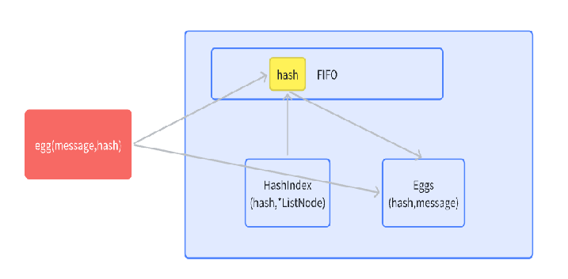
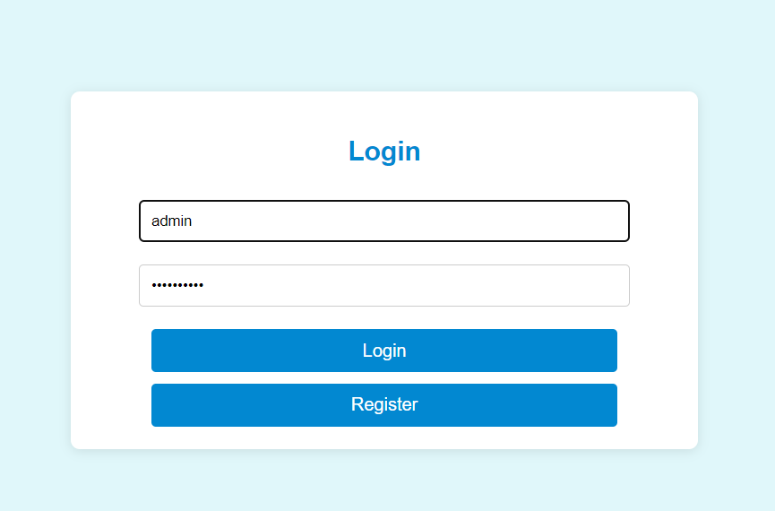
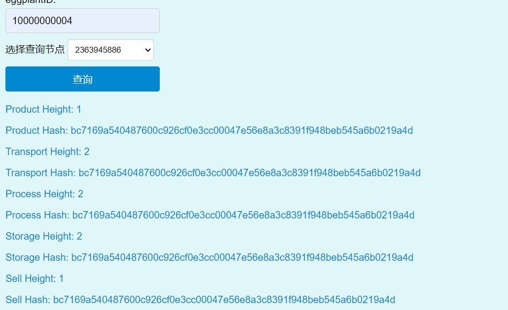

# Trace of Product
## Application Background
In today's society, the issue of agricultural product quality and safety has attracted much attention. With the improvement of people's living standards, the requirements for the quality and safety of agricultural products are getting higher and higher. However, the traditional agricultural product supply chain has many problems, such as information asymmetry, data tampering, and difficult traceability, which seriously affect consumers' trust in agricultural products.


Blockchain has the characteristics of decentralization, immutability, and traceability, which can provide a new solution for agricultural product traceability. In recent years, blockchain technology has been widely applied in various fields, but its application in the field of agricultural product traceability is still in the initial stage and can be further studied and explored.

## Problems to be Solved
The Agricultural Product Traceability System proposes a blockchain-based agricultural product traceability solution combined with multiple chains, which can effectively solve the problems existing in the traditional agricultural product traceability system. By storing the information of agricultural product production, transportation, processing, storage, sales, and other links on the side chains separately and indexing them on the main chain, the whole-process traceability of agricultural product information can be realized, improving the accuracy and credibility of agricultural product traceability. This helps protect the interests of consumers and enhance the authentication in recording of agricultural products. In addition, this solution can also promote information sharing and collaboration among all links of the agricultural product supply chain, improve the efficiency and transparency of the supply chain, and promote the healthy development of the agricultural product industry.


## Design Ideas and Solutions
The main body of this project can be divided into three major modules: the blockchain module, the management system, and the encryption module. The design of these three modules in this project is as follows:

### Blockchain Module
#### Design of Blockchain Storage Structure
The blockchain is a distributed ledger composed of a series of chain data structures, and each data block (block) contains transaction records within a certain period of time. The blocks are connected in chronological order to form an immutable chain. Each node in the blockchain network jointly maintains the consistency of the ledger without relying on a centralized institution. In this project, the ordinary blockchain structure has been optimized, and a multi-chain combined main-side chain structure is proposed. According to the importance and security of the data, the data is stored hierarchically on different side chains, and only the index is stored on the main chain. This not only ensures the security of data storage but also greatly reduces the storage pressure on the main chain, which can adapt to the recording scenarios of different types of agricultural product information.

```go
//Design of Data Structure Stored on the Main Chain
type MetaData struct {
	EggplantId      int        `json:"eggplant_id"`
	ProductHeight   int        `json:"product_height"`
	ProductHash     types.Hash `json:"product_hash"`
	TransportHeight int        `json:"transport_height"`
	TransportHash   types.Hash `json:"transport_hash"`
	ProcessHeight   int        `json:"process_height"`
	ProcessHash     types.Hash `json:"process_hash"`
	StorageHeight   int        `json:"storage_height"`
	StorageHash     types.Hash `json:"storage_hash"`
	SellHeight      int        `json:"sell_height"`
	SellHash        types.Hash `json:"sell_hash"`
}
```

#### Design of Block Structure
The block structure of this project mainly consists of the block header module, the storage information module, and the verification information module. The block header stores the version, height, and other metadata of the block, as well as the node reputation value data related to the subsequent election algorithm. The storage module stores agricultural product information, and the verification module mainly consists of the leader node information and the leader node signature.
```go
type Header struct {
        Version       int32
        PrevBlockHash types.Hash
        DataHash      types.Hash
        Timestamp     int64
        Height        int32
        Nonce         int64
        Scores        map[int]int
        Leader        int
}

type Block struct {
	*Header
	Eggplants []*Eggplant
	Validator []byte
	Signature []byte
	BlockHash types.Hash
}
```

#### Design of Consensus Algorithm
The consensus algorithm is a core component of blockchain technology. It ensures the consistency of the ledger state in a distributed network. Common consensus algorithms include Proof of Work (PoW), Proof of Stake (PoS), Practical Byzantine Fault Tolerance (PBFT), etc. This project uses the Credit Supervised Byzantine Fault Tolerance (CSBFT) to achieve lower latency and higher security. Table 1 Supervised Node Reputation Value Change Algorithm



At the same time, based on the original CSBFT algorithm, this project has made the following optimizations to improve the decentralization degree, node reliability, and record security of the consortium chain:
1. Prohibit the nodes from the previous round from participating in this round of selection to avoid centralization and monopoly in the consortium chain.
2. Prohibit the nodes that do not participate in the voting in this round from participating in the leader election to ensure the performance and good reputation of the leader node near the block generation period.
3. Halve the scores of the previous round and pay more attention to the performance of the nodes in the near block generation cycle during the leader node election.
4. Update the score records along with the chain to ensure the security of the score records. Start Count whether the agricultural product data it verifies has been uploaded to the chain this time. Does it participate in the verification this time? No Common Node


Finally, this project has optimized the information dissemination mechanism compared to the traditional PBFT algorithm. By introducing a random nonce in the Prepare message stage, it prevents malicious nodes from forging the Commit signature through the signature in the Prepare stage, providing higher security.

#### Design of Memory Pool Structure
In the consortium chain system, after receiving the agricultural product information from the client, the information is verified, and the verified information is stored in the memory pool for the block generation operation. The memory pool uses a hash table to store information, which can efficiently ensure the idempotency of the data upload operation. At the same time, the memory pool uses the First-In-First-Out (FIFO) mode for data entry and exit operations, effectively ensuring the priority of processing the uploaded data first. Considering the possible inconsistency of data at different nodes in the distributed system, after the block is generated, the memory pools of all nodes need to be synchronized to prevent the subsequent repeated submission of some data. This requires efficient deletion operations for the memory pool. This project has optimized and transformed the FIFO channel by using a doubly linked list and a hash index. On the one hand, it can quickly add tail elements and delete head elements with a time complexity of O(1), functioning as a first-in-first-out channel during data upload. On the other hand, it can quickly find duplicate elements through the hash index. Finally, the doubly linked list has a very low deletion cost, unlike arrays, which require significant displacement costs to maintain memory continuity.



#### Design of Consortium Chain Management System
This system is an consortium chain management system, and the functions it implements mainly include the access verification for consortium chain nodes, the access verification for client nodes, and the realization of two-way interaction between the consortium chain nodes and the client.

#### Design of Client Login Module
After the user uploads the login information through this interface, it will return to the database for verification. If the user exists in the database and the password is correct, the server will return the jwt token signed by the service side; otherwise, an error will be returned. 


#### Design of JWT Verification Middleware
Before the user performs data upload and data query operations, the server will first verify the token in the client's cookie. If the token exists and is not expired (in this project, the token validity is set to 24 hours), the access will be successful; otherwise, the user will be redirected to the login page. 


#### Interface for Querying the Status of the Consortium Chain
This interface will return the ID, corresponding IP, reputation value, and other information of all registered consortium chain nodes.


#### Interface for Uploading Agricultural Product Data
The user uploads the original information of the agricultural product on the front-end page and specifies the node for synchronizing the information (in this system, based on the optimized ordinary PBFT communication mechanism, under the premise of ensuring security, not limited to the leader node receiving the agricultural product information, any node can broadcast the information to the whole network after receiving it, thus greatly sharing the communication pressure of the leader in the traditional PBFT). The management system initiates a synchronization request to the consortium chain, and after the consortium chain nodes synchronize and pass, the data will be placed in the memory pool and wait for the block generation.


#### Interface for Querying Agricultural Product Information
After the user inputs the ID of the agricultural product and specifies the query node on the client side, the back-end parses the message and first queries whether the relevant agricultural product information exists in the local redis database cache. If it exists, it will be returned directly; otherwise, a data update request will be initiated to the blockchain. And within a certain period of time, it will continuously access redis to query whether the data exists. If it exists, it will be returned to the client; otherwise, it will return that the agricultural product does not exist.


#### Interface for Alliance Chain Metadata
This interface is used for docking with the alliance chain nodes and can receive the query results of the alliance chain. When a request is monitored, the system first monitors the signature of the alliance chain node. After the signature verification passes, the information is placed in the local cache and waits for the client to query.
```go
func (c *ChainModel) HandleChainResponse(ctx *gin.Context) {
	metaData := models.MetaData{}
	if err := ctx.ShouldBindJSON(&metaData); err != nil {
		utils.LogMsg([]string{"HandleChainResponse"}, []string{"can not decode metadata err=" + err.Error()})
		return
	}
	if !metaData.Verify() {
		utils.LogMsg([]string{"HandleChainResponse"}, []string{"metadata verify failed"})
		return
	}
	key := strconv.Itoa(metaData.EggplantId)
	byteData, err := json.Marshal(metaData)
	if err != nil {
		utils.LogMsg([]string{"HandleChainResponse"}, []string{"metaData marshal failed err=" + err.Error()})
	}

	res := c.reDB.Db.Set(key, string(byteData), 60*60*time.Second)
	if res.Err() != nil {
		utils.LogMsg([]string{""}, []string{"set key failed err = " + res.Err().Error()})
	}
}

```

### Design of Encryption Module
#### snark-js
ZK-SNARK implemented by JS and pure Web Assembly, internally implementing three algorithms: Groth16, Plonk, and FFLONK (Beta version). snarkjs inherits all the components required by all protocols, including the NMPC execution process for the initial trusted setup (to calculate the power of the global ττ) and the calculation of the proof for the specified circuit. snarkjs is based on nodejs and calculates using the circuit compiled by circom. snarkjs adopts the ES mode and can be directly deployed to projects such as rollup or webpack.

In this project, the snark verification call using the Groth16 algorithm and the bn128 curve is adopted.

#### Arkwork-rs
Arkworks is a Rust ecosystem for zkSNARK programming. The libraries in the arkworks ecosystem provide efficient implementations of all the components required to implement zkSNARK applications, from common finite fields to R1CS constraints for common functions.
In this project, the arkwork-rs algorithm library is used to implement a plookup privacy protection query function, and an attempt is made to modify the source code to create a general API.

#### Main Process of snark-js


#### Compilation of Encryption Process


## Software Flow Chart


## Containerized Deployment of the Program
1. intialize the environment variables  
```shell
./init.sh
```
2. Enter the controller_system folder and package the Docker image.
```shell
docker build -t control_system .
```
3. Use docker - compose to start the MySQL, Redis databases and the back - end program.
```shell
docker-compose up -d
```
4. Enter trace_of_product to package the node image file.
```shell
docker build -t node .
```
5. Start the consortium blockchain nodes.
```shell
docker run --name=node1 --network trace_of_product -e IP=node1 -e NODE_NAME=node1 -id node
```
If you just want to build a simple regional consortium blockchain network on your own, this project provides a four - node consortium blockchain network startup script. You can perform the following operations to start it.
```shell
./quick-start.sh
```
6. Enter front-end and package the front-end image.
```shell
docker build -t front-end .
```

7. Start the front - end container.
```shell
docker run --name = menu -p 8880:80 --network trace_of_product -id front-end
```
