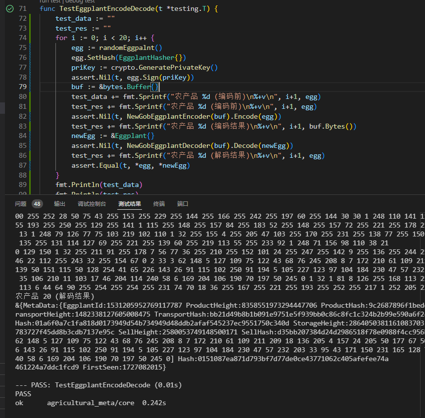
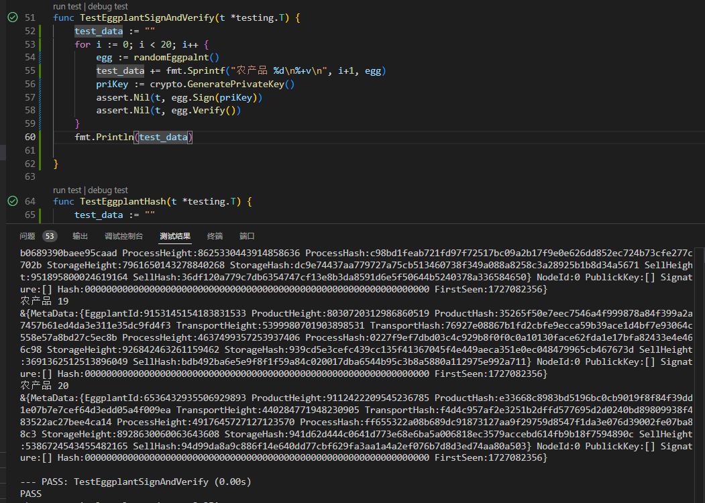

# 农产追溯通测试报告
## 测试平台
### 硬件环境
+ Linux 系统版本  
Ubuntu 22.04.2 LTS  
Architecture:            x86_64
  CPU op-mode(s):        32-bit, 64-bit
  Address sizes:         42 bits physical, 48 bits virtual
  Byte Order:            Little Endian  
CPU(s):                  2
  On-line CPU(s) list:   0,1

+ Windows 系统版本  
Microsoft Windows [版本 10.0.22000.2538]  
系统制造商:       HUAWEI  
系统型号:         NBM-WXX9  
系统类型:         x64-based PC  
物理内存总量:     15,707 MB  
可用的物理内存:   6,356 MB  
虚拟内存: 最大值: 19,291 MB  
### 软件环境
go version go1.20.1 windows/amd64  
mysql version 8.0.35 MySQL Community Server  
redis version Redis server v=5.0.14.1  
vs-code version 1.93.1  
Docker version 26.1.2, build 211e74b  
docker-compose version 1.29.2, build unknown  
## 功能测试
### Eggplant 模块测试
#### Eggplant 哈希模块测试
+ 测试数据 
```
txt 
农产品 1
&{MetaData:{EggplantId:5540618150529896455 ProductHeight:2438605078953659905 ProductHash:032afdb034938416b2f22b8d8f083706463b61c0960ac682a51c9ec6e3abc13e TransportHeight:4550927625349063967 TransportHash:904b50ebae7e4c486bae476815c67672bbcbcbd9a582bb696a0e826260d08192 ProcessHeight:6917575698986163150 ProcessHash:4c4696da038a4dffd6f3ae749ef5099649f7a3ffcff343f903f43f86caf40002 StorageHeight:7425442131495938632 StorageHash:f148d749d0b028b117bcfca88df52c6c8d2d16be8feb779e6cda82337cce04f1 SellHeight:1690808002543180065 SellHash:545b63f62951557e884c08e993561cd068ee32d2926a002a1ea76ca188140135} NodeId:0 PublickKey:[] Signature:[] Hash:0000000000000000000000000000000000000000000000000000000000000000 FirstSeen:1727080939}
农产品 2
&{MetaData:{EggplantId:6583256147151059880 ProductHeight:7534736746478573708 ProductHash:60667dd5aae5711164f0a89191311d781d059e052ea9beffc7512fc633adcd4a TransportHeight:3809862704468645078 TransportHash:f55f5f127b49c3ffcd3303fbeaf470eed848cbfe83590946c9e6744405b4d236 ProcessHeight:8574588425398833969 ProcessHash:0f89f3b0b1f36761164662bae4f7c0b516a2bd1ea55e3a27728fc823d0a13115 StorageHeight:5729165508344332777 StorageHash:a01c52d165175a71611960c007069c6d1e73e7a06d693e4856f5460dce620ac7 SellHeight:8629506813974210458 SellHash:f2cbbd73b43ee225b68721b137558f2ff689a3f48dc402659d3e78bf3385a432} NodeId:0 PublickKey:[] Signature:[] Hash:0000000000000000000000000000000000000000000000000000000000000000 FirstSeen:1727080939}
农产品 3
&{MetaData:{EggplantId:4375619069678094721 ProductHeight:6144068290685776530 ProductHash:0facd257ae8f4c5e5f932493a41544b3f8e5457af39e874fee6e6d094477d889 TransportHeight:7859647190269617386 TransportHash:fded7c692cd73acb28ca65e2227ad58d64465c190d986e7ff6da401289d64802 ProcessHeight:3754120217673867400 ProcessHash:33c6e555a0f8aa94e5b376fe1887f5a2666fd776d1d228264ec21c2071f81185 StorageHeight:4569903758423103648 StorageHash:fa7922e16b664d5fdafd868aa716fb295697b7754ff23d7d3ba4412ba26a5130 SellHeight:5844226633953064268 SellHash:9dfd6b25faa8dbb3a4951b3d7c4a35fd984f466f373eca9a65c8fd3f05458fbe} NodeId:0 PublickKey:[] Signature:[] Hash:0000000000000000000000000000000000000000000000000000000000000000 FirstSeen:1727080939}
农产品 4
&{MetaData:{EggplantId:3771141161840214123 ProductHeight:8020395240323332650 ProductHash:247fdb017bfe209357197de50aa19aeabc5a4ef7f28745e029b1bf250ec3adef TransportHeight:5720002873908998665 TransportHash:4d5660486c0b3cbdf364d9a100f9348fb05c525336e7f3a8225d10e1e01d2163 ProcessHeight:155510237743065203 ProcessHash:09cbada025e719a14179ffdd9e765f9f21d443cbb99196d1af137be2be7f0c93 StorageHeight:366114324605016600 StorageHash:88ef708c1297b6a66d5c2eb2657578e7683d3eb0c830dbb171d352a12dbee59a SellHeight:4168351274423431354 SellHash:c8bbe52ff8f2896ece5f7360bd4ad56f7e6bcde98511e2c332af09767bb7ca0e} NodeId:0 PublickKey:[] Signature:[] Hash:0000000000000000000000000000000000000000000000000000000000000000 FirstSeen:1727080939}
农产品 5
&{MetaData:{EggplantId:2345742980598034997 ProductHeight:7336454175527091077 ProductHash:39260a170ce8ffdfd95b4ad23f79dff26de837024c87cf55c36ba593444e51da TransportHeight:8048308029170513499 TransportHash:b8253a84313f532fd21db7d7057eb42213f6eca0fc6393cdd86f00e93bee947b ProcessHeight:7899366198380176101 ProcessHash:ac269957061abe88991c5dc303b2b38d3663f569c90da85f1b9073f6509c94c2 StorageHeight:7620963220047918066 StorageHash:6fe2924501afee58addeb70528d4e7ebf6d869069043cd963a5c983f27ce1fa9 SellHeight:8643803342552325984 SellHash:32e813e40e7cc6732aee06041780ffd9607adf00d4258129e0a53c344a164ea5} NodeId:0 PublickKey:[] Signature:[] Hash:0000000000000000000000000000000000000000000000000000000000000000 FirstSeen:1727080939}
农产品 6
&{MetaData:{EggplantId:3456165428520424885 ProductHeight:6922339425443500560 ProductHash:4a82c10f7708ff70e17d8dcd6930bc26b577269c0aed1f0daa88871a58df010e TransportHeight:4921979182744771855 TransportHash:b8d37a5d19cd5e186ad08639e7a5a1295344602ff9f34f56bfc42cfe902ffaf1 ProcessHeight:4151877962835561394 ProcessHash:4591afddc0819afff4000153cbe8954346a218ccf2fd6f161fbf7784758b28f1 StorageHeight:1648392427773094934 StorageHash:9f9e4927162257ecedcf3bb529e2649c12e5e9d14b11f3c0f4bdb3b11da5b63f SellHeight:4612750596577667536 SellHash:c516e217475d0980739ff0354b0b3df12424e49ab124df6dabfb0563788e157d} NodeId:0 PublickKey:[] Signature:[] Hash:0000000000000000000000000000000000000000000000000000000000000000 FirstSeen:1727080939}
农产品 7
&{MetaData:{EggplantId:6544713308794348364 ProductHeight:8107538611448924490 ProductHash:4376b2a0d61aba8370244fad99509e7ff69b26e9d430c334c4bb2f162a6f9feb TransportHeight:7601474113302681160 TransportHash:86c81789bdccc63c617fdca21e56a678204daacf9ba9b33316110c94631a8926 ProcessHeight:803887069152143086 ProcessHash:b3a8554897d1f6ac4d9d4360cf053b926ac40ffd3e23accbe8bb81c5889dcc3b StorageHeight:472489801835266073 StorageHash:8220e52097afd9913aefa1791cf6bd769d05dc14241a17f135fc0bcbe582c610 SellHeight:2026867196638083438 SellHash:e4f5405f877299b02d8b2455716c6672c467150a79e3fe6f607c5476244c5723} NodeId:0 PublickKey:[] Signature:[] Hash:0000000000000000000000000000000000000000000000000000000000000000 FirstSeen:1727080939}
农产品 8
&{MetaData:{EggplantId:3419410237967082797 ProductHeight:2285817092742883738 ProductHash:6a9d54664cf0e1c780e661a4131d6c67a35e749d18d49cf656f8ecfa9f2873c9 TransportHeight:8897879679214226304 TransportHash:c27d26d1decd334ec26739b5b62ee888b15cc8b1f6d44d86edb71b4012c036ab ProcessHeight:5810653080462204894 ProcessHash:1ca5b8107f750f2099b43f93fae00129a93acc518c2258dab53736d0204b2299 StorageHeight:4432233817259337114 StorageHash:6b82e63b756d39ed2cafa8d9c07e834be493eb65d18d070972dc53b3292f51b1 SellHeight:2273260807755717885 SellHash:f09d9370e7b3fbb1670019b7b903742a1f69b8078f773ec69b5e9f2f7e2d50fb} NodeId:0 PublickKey:[] Signature:[] Hash:0000000000000000000000000000000000000000000000000000000000000000 FirstSeen:1727080939}
农产品 9
&{MetaData:{EggplantId:2291859801562936777 ProductHeight:8569607872734860956 ProductHash:1e5fe3f4123e164d52e36d48b766f76c81f5798ef1a07ef51caeb4fa455ddae5 TransportHeight:3640518117338061299 TransportHash:eddc6e2987efa4512daeb52b908ebce12649c601a8b20a5f9c82e171813ca53d ProcessHeight:7865290212696668244 ProcessHash:a6324e5c29fbb9606f047a739d9683bf8efa198b6d88275cc887e0e4e54b4bea StorageHeight:4149977888328062028 StorageHash:51af770bdd16fbd41583dafaff01d3a1635ef3c8ffdd9330b0b009314e588a5a SellHeight:2876678556544097597 SellHash:884c8b1deab4aa16a5f54003c5d166a1e3e0d497e0fd5486cc504af3a18594c0} NodeId:0 PublickKey:[] Signature:[] Hash:0000000000000000000000000000000000000000000000000000000000000000 FirstSeen:1727080939}
农产品 10
&{MetaData:{EggplantId:2074571641861008338 ProductHeight:3161678271077293871 ProductHash:ccca062138ae0de03c7af096f5867213b7bdb80b26fcc8ec3a047348fade176d TransportHeight:1636855978588771858 TransportHash:25570adb1519e3a92b3f43d446d68366438dec7152c709df1ad7ca25ab776526 ProcessHeight:8194387612765538059 ProcessHash:91f51858d1c7e3d7245c4066dcf05ad4679e4ee60d8f3fc02305ae11d2623b8f StorageHeight:6656704331867834493 StorageHash:ebf5b0043db4f9a4e799b5c07b6b35daf19ed8dafef98976f21f3cb1d4c2ffa4 SellHeight:4854069986211584929 SellHash:510fb4f042a472640bdfdd02fc6b4c90bf65fbe55d6f9548a92aa9efa30ee877} NodeId:0 PublickKey:[] Signature:[] Hash:0000000000000000000000000000000000000000000000000000000000000000 FirstSeen:1727080939}
农产品 11
&{MetaData:{EggplantId:1638605889285343926 ProductHeight:5792624724920349629 ProductHash:f810cf722fee5d831764582994c466505f8f1468e157ccaef35a156d4aeb2d1a TransportHeight:1852127773405852727 TransportHash:b127a8c7c92b662b3811dea0348cf4476e2bc9d4034cace95556366281b474ad ProcessHeight:4314320709631528245 ProcessHash:18f95ba64b53ff0f60c769e84da713fee63e70fe604a93657710ef1e656659d8 StorageHeight:72253664905205178 StorageHash:d9bbda19916133f9aa1427d0f9c3d74b02a73c654d8fc1f7c35648d63f32a9cc SellHeight:7543854330227787755 SellHash:dd9333420eb9f2f2fe108ff2098c320ccfce249e687b425acc20a8faed6ceac6} NodeId:0 PublickKey:[] Signature:[] Hash:0000000000000000000000000000000000000000000000000000000000000000 FirstSeen:1727080939}
农产品 12
&{MetaData:{EggplantId:7369485166811800913 ProductHeight:3327039676810258473 ProductHash:166a9b025c550c05059f711b57f59ca85f14bdf2827cc9186659459c01074341 TransportHeight:1261703911462778352 TransportHash:c0b36c2194efbea0dbc5c96ca1f44ccaff07312d22013800952bee727dc37e7a ProcessHeight:7433220584468414367 ProcessHash:e1da0fe7c61e30e146ecec5b33593004fb45978f2ae91b9c15d53f5f23dad2e4 StorageHeight:3060740585562407841 StorageHash:4dcbfcd0f62e675fc2e886bb9586c59acd5099696629c30642e9d74103286247 SellHeight:1521465001172089054 SellHash:c6050f2bd3c4690adb9641ea38f88265263ff0967faeeb9750cfbd96e7f37d2a} NodeId:0 PublickKey:[] Signature:[] Hash:0000000000000000000000000000000000000000000000000000000000000000 FirstSeen:1727080939}
农产品 13
&{MetaData:{EggplantId:8675181695391518345 ProductHeight:2794796115634143005 ProductHash:e53ebe6123fd3d0214c31f7337232f0cda3d7872e8c5ff04169a33a24befc915 TransportHeight:7123957281184384641 TransportHash:159bde8f4b2a28b33ebe665979cc07e5f316a80de64d17084f6897f987295f5a ProcessHeight:6795766744695796134 ProcessHash:858d8db1426b602b541b0acdfd5cfba1fe44e2e40ee07b6ea2f7bfa3360670ab StorageHeight:6040562369915711097 StorageHash:555e3c755ee3991b95235622912731e9ed452b838fa435a5c228eb8ed34b6e98 SellHeight:3541152054196863083 SellHash:bd9f73589a58764e7f8f33c6045c01418f4c209a3b60dc715876defdff2f9eda} NodeId:0 PublickKey:[] Signature:[] Hash:0000000000000000000000000000000000000000000000000000000000000000 FirstSeen:1727080939}
农产品 14
&{MetaData:{EggplantId:2679491443800558228 ProductHeight:7607058306335367609 ProductHash:dba66ba31f2dec76139a6d3197e9165ec08654833894e7d56b25fd39a6abc9b6 TransportHeight:7422113967183217288 TransportHash:24a639cfa82cde3d06e86fd96d22b359852d7462b44e8ad70000445392b43444 ProcessHeight:7239864845044975789 ProcessHash:c59b347ed952a7ae77bd435e446ee7c01e54f1146e4552c9ba4919cdeb525b7a StorageHeight:8476009989444030201 StorageHash:2e641f6d78be4044689fdb9f8d1d1835ed578779fc5d7c61763389def473fd7e SellHeight:233968459643057646 SellHash:c8c4bc2c29f769d20127f55864e934663b752f742621a51cfb71713d44f5c5f6} NodeId:0 PublickKey:[] Signature:[] Hash:0000000000000000000000000000000000000000000000000000000000000000 FirstSeen:1727080939}
农产品 15
&{MetaData:{EggplantId:6511897775527673145 ProductHeight:7574551757633439289 ProductHash:7e652063817699617094b54d5bacb54cafdfd3bebd738cc3890c171cb00a4e6c TransportHeight:4555233127871742991 TransportHash:dd6b4daf401770d74f428586716a0a4aa129dddb699865dcc874c5083d115a40 ProcessHeight:6261819947117507815 ProcessHash:64c01774650a22fe0b29cdfc3927e9e88d5052d36dfd6efdde19ef038151a17e StorageHeight:4089802764866949648 StorageHash:d93c169bac99acbd3ea3ebd57937866fb580759dac086889704eab843dac1ab1 SellHeight:388435006510255954 SellHash:47e7307cb77cf7473fbf2e8bc8627cf202018a6dcbd7cb9b6074d051bf8a49c1} NodeId:0 PublickKey:[] Signature:[] Hash:0000000000000000000000000000000000000000000000000000000000000000 FirstSeen:1727080939}
农产品 16
&{MetaData:{EggplantId:4028824849173197777 ProductHeight:5360483262026618846 ProductHash:f999da97e152ef898449f0148291818a82157e19dca1a6d0330d92c90ebb504f TransportHeight:6056305008329722096 TransportHash:d0be64efe8c2dbe1183562db029b4bda36eedef8a4f0b57bfbf1a85f5c4547eb ProcessHeight:191220443074705380 ProcessHash:f4a99f7b43412d041c476454e18da90764856844f2492bcfe3185345656c061b StorageHeight:4491472499964065005 StorageHash:b12a1355d51e7d2db5bdc1c12fae0eacf92167e90ca419f428799645c95e7588 SellHeight:6186248937385596349 SellHash:2fb532550c85964ae873035428fa5a8866159529836c321300ec004b20a0903e} NodeId:0 PublickKey:[] Signature:[] Hash:0000000000000000000000000000000000000000000000000000000000000000 FirstSeen:1727080939}
农产品 17
&{MetaData:{EggplantId:5425493809250262149 ProductHeight:2125816000927786273 ProductHash:13270ad24061d3441cdf92215976a0cec4aa00173d1afb7b008ecdf5932b6f75 TransportHeight:5800070688786333412 TransportHash:8359ed0730e4661f26736c475bcc3072ebaac7363e8866c9e56310eafd422237 ProcessHeight:2948491140996901313 ProcessHash:a0e9dc677e74622e99d257d8f19670f50334ffcb42d79a31eb546970aa620952 StorageHeight:5423485829286828504 StorageHash:b47cee65d01245c841595cc71ccdbd72291192c065f74cbf21229635a8678cba SellHeight:512463971392982909 SellHash:fdc54fcda29fb96ac8a094d349566935b20b1cc27e9ea4930def65b2598ec526} NodeId:0 PublickKey:[] Signature:[] Hash:0000000000000000000000000000000000000000000000000000000000000000 FirstSeen:1727080939}
农产品 18
&{MetaData:{EggplantId:3331423838051572751 ProductHeight:1788954860063090857 ProductHash:40d559d2a1aaa0942ceb0b99181f642edfb40d97a250db44ce454b8ecf051d51 TransportHeight:6646235369018241371 TransportHash:e64b9d2de85aa6c899227d4a0aec5a89f78e7b71d6faa8bffeebe9cb48f1e4ee ProcessHeight:7679676894545338199 ProcessHash:9e43c3c0c619910e726d35f84e64c4e0460f055985ddbc12dd0387b54ce0812d StorageHeight:2852734157818105816 StorageHash:129d2cbdc765a9f134bb21d9d98169f3b60d7e6f2f293b88e231674b1820fba7 SellHeight:3277351883609872813 SellHash:d903088664db3c7c37f0b66cf4a46d6cb445c6e120ebdd525ec59d9049c724c5} NodeId:0 PublickKey:[] Signature:[] Hash:0000000000000000000000000000000000000000000000000000000000000000 FirstSeen:1727080939}
农产品 19
&{MetaData:{EggplantId:3669171143797626725 ProductHeight:700136740359662153 ProductHash:76ac79b8c0a8f6d9879534c3ead0b2a89d33928578edae137474de0d66627078 TransportHeight:5897298081256100784 TransportHash:9704b4ae8fe26d8e45354e52b005c489522e711ddbf26f3fc727c2e656a0d785 ProcessHeight:4550453219013426910 ProcessHash:3bfd2d7220deac6004069efe4aad63299a828fd05742c7dd821bedcacbfd26ed StorageHeight:4382905931234441568 StorageHash:cac218d923f6de7fae97065b759c5e93414a48aa07fd119fc35122e0fb325250 SellHeight:2430118754019142599 SellHash:a0364e595583073f2d3ed1259836ed8399eff407afa264223ee6a7a262599944} NodeId:0 PublickKey:[] Signature:[] Hash:0000000000000000000000000000000000000000000000000000000000000000 FirstSeen:1727080939}
农产品 20
&{MetaData:{EggplantId:8042524583499590314 ProductHeight:1288533053471628389 ProductHash:6241bf628b8d3c3e92cdc7f4088ce8688453c18168a986a0bdf1bf1e5439b350 TransportHeight:8709363926466352105 TransportHash:75acc3a5b7c9ac60c4af556e0d46823682b54185951c3770f9083dc6e9b3f152 ProcessHeight:713359746918748361 ProcessHash:56ab56f1042dc6b9a3f15f91a9dd42b8c5d41b5029623953323f29579385631b StorageHeight:3792625194318720341 StorageHash:7ebacb617a47dfa2d29a49fc6eb72bba3e8e15e48f20c28f2e1f7ef895376eb1 SellHeight:6144096608301981736 SellHash:a53171b2e611e0395a9026eadd3dab83fab0bfd54dc3256328bd7bfc2c88eb05} NodeId:0 PublickKey:[] Signature:[] Hash:0000000000000000000000000000000000000000000000000000000000000000 FirstSeen:1727080939}
```

+ 测试结果  
  
--- PASS: TestEggplantHash (0.00s)

#### Eggplant 二进制编码模块测试
+ 测试数据  
```
农产品 1 (编码前)
&{MetaData:{EggplantId:3944149580653099574 ProductHeight:3796839389895441599 ProductHash:cff527c9d0767bc18d8b39c45533af97aec70de286e76b2f1c7de155f6070799 TransportHeight:2301506483062101157 TransportHash:677371a8448fb21bcf6dc4ce5e849772c08379c194c6cfb8c1bffa2997a70463 ProcessHeight:2351705757424505849 ProcessHash:fbc11929162ec92413790be15ae914f32eb7dc9b1b58819ecd28092a543c0a65 StorageHeight:8554518440104883615 StorageHash:a2134e366743dfae0f0728b485975e280416a7dfa22ccfa6bd7c2a41dc8f0c8e SellHeight:957363364026697658 SellHash:6c6403223e044ae65333fbe71076c6d378c883836b416a701c33cf9ac142e30e} NodeId:0 PublickKey:[2 64 129 63 75 134 176 51 217 174 56 68 205 77 56 37 159 154 237 175 244 21 126 37 112 46 97 24 135 35 47 113 160] Signature:[51 5 188 221 215 220 76 0 47 128 16 159 226 225 26 92 218 15 178 91 235 209 105 228 21 175 33 74 72 201 69 189 45 110 204 95 98 52 244 26 53 22 250 201 241 155 35 160 142 70 22 253 180 81 214 19 125 185 244 107 239 125 197 10] Hash:f986a0c86ca2ebd3e84649a086ce175dc22d4f966785f0741
c14639aad22feaf FirstSeen:1727082015}
农产品 2 (编码前)
&{MetaData:{EggplantId:7411577619695608796 ProductHeight:3035934881137604533 ProductHash:deb5bb246508b434b7e224b50929ee91c8fa156829f63d720b8abffbec64aebd TransportHeight:9051670670788038879 TransportHash:58eedd93538baea2da62da59426d386f3f73218470dec606efb5f4ca12e7f3fc ProcessHeight:2013540138595374169 ProcessHash:456a8e1884adae8b5e06b865192d81d221c034c582d1fbfce055b636f5a8cd7a StorageHeight:2018892962472634848 StorageHash:9d0e0cbaeba6e84a894f257f3ba3c427c6bb6d83bde970d9422d344bb8f9285c SellHeight:3073083283186037377 SellHash:ef3cc63783b01d2e92d6a502bcbb4577303dd777cf8d5cd00cc5331c362084b6} NodeId:0 PublickKey:[2 193 74 202 205 32 211 186 185 83 237 198 186 101 177 198 170 218 155 167 110 91 25 28 220 220 243 51 146 51 225 130 105] Signature:[29 84 200 209 180 223 240 66 78 202 70 233 165 227 126 121 213 173 118 16 162 229 211 220 178 235 202 200 130 49 119 225 44 21 173 240 167 87 172 231 28 53 26 186 102 121 228 72 95 69 81 166 136 10 151 117 137 209 67 196 110 228 19 76] Hash:65ce198f4acb24e458bb3599e04ef7c
a878fd4c32d08ef0fd1ed8ec5fea19d13 FirstSeen:1727082015}
农产品 3 (编码前)
&{MetaData:{EggplantId:3866777124283998744 ProductHeight:4056435222334799083 ProductHash:ebd42aa0eba4f49aa88686dd7e850d32e69340c1507f39f82f28af272c42234d TransportHeight:8871574136178540440 TransportHash:319da9df0b5301c0c3574e5ed8353624d47e0138b35ab2d645ae42353099c487 ProcessHeight:527603954568041383 ProcessHash:1b15ede16980d8e94427f6469e7de361d550665c0afa5044ed29f17ddd1d8444 StorageHeight:2134012643218148058 StorageHash:33a222e1c83ddd73cbe6600c50a7e4c48c059952d876bdd7fe48ac714b460bdd SellHeight:893378194463706030 SellHash:6ad910e610249d020bfd533667612d24ae364cabf0c594d5477bebb4b0be3875} NodeId:0 PublickKey:[3 69 22 164 20 16 234 219 225 76 6 147 95 111 60 61 115 213 181 67 219 223 181 135 176 102 41 181 159 225 105 103 154] Signature:[143 200 117 148 180 15 209 118 92 90 113 201 235 239 183 21 110 61 25 180 112 158 6 194 157 44 179 138 245 153 100 110 1 210 131 228 215 48 95 8 254 62 78 234 128 108 85 130 69 35 69 76 86 59 188 206 29 213 2 128 108 180 216 205] Hash:761c55705533c9b8a533db94e57260ae3b4b32f9a1e
98c20bcccde35cffd35aa FirstSeen:1727082015}
农产品 4 (编码前)
&{MetaData:{EggplantId:1514515740309574576 ProductHeight:53988915936036660 ProductHash:ded0e0d64cf278a322c22084c87a67f948b052e5784fc11e171d5248fd5dabc8 TransportHeight:5457799810048499295 TransportHash:4420bf9e8252ff8657102b0b8166fd6ffbeff0501af8a7da3a670f0e586c858f ProcessHeight:7300618433853707900 ProcessHash:06c3d702f21df52d59636ebe781f0b8b372ccb5ceeae68a0a5512defdfadf298 StorageHeight:3882632107523475748 StorageHash:e9d803fb26667f6eb81ee03bb011fdb3ffa57aa9e470789d8ca8a139271df2f3 SellHeight:3850018452956158168 SellHash:af737f135ce551b5ef5c01b2ab59cff7999614e19362a83b49cbe06a505c8f6b} NodeId:0 PublickKey:[2 71 225 128 64 31 253 78 123 219 60 34 232 48 163 99 213 30 119 121 192 123 186 240 87 4 173 242 93 231 67 14 31] Signature:[198 199 226 49 102 215 132 36 56 239 52 22 225 205 191 230 169 49 240 120 53 106 56 222 123 29 124 176 28 154 16 227 87 74 227 181 188 25 110 166 225 56 237 145 211 152 240 236 246 104 42 247 242 11 143 22 232 161 177 5 104 6 127 240] Hash:e61e44718ef88c1c2d8e59ff27440c69ebd15785f1
300ddcd0786c4a17105f58 FirstSeen:1727082015}
农产品 5 (编码前)
&{MetaData:{EggplantId:5426948787818608719 ProductHeight:5480320020473613369 ProductHash:185a1991c62b8f60ffbc5535d212dc6f7ce0365c29c5dd39c698598a7ea37e5e TransportHeight:1182116735370929255 TransportHash:15434b3939a9ab070e6d2ed3c8715d6e49453200035919b3bac7579799a4e084 ProcessHeight:3043285295728785175 ProcessHash:2a9d2d8cace5449c546c101317ccac2f78e36003c579aab34645bd0ad863ee37 StorageHeight:3186962340344808355 StorageHash:c09f4fb18a351c46c7e6e298b0ba41cdc878d05e23f5db0ff72583a61e66d57f SellHeight:1143556022101139550 SellHash:0f0d7094b767bed52b1eceae22c35baa19432cfa32829cf556f06f905bdab0cb} NodeId:0 PublickKey:[2 71 71 68 125 29 24 77 214 195 1 35 231 37 158 2 47 118 102 107 205 33 101 166 199 65 175 96 150 188 113 107 56] Signature:[18 50 75 168 36 208 163 22 27 99 26 121 233 121 96 158 50 19 124 72 241 218 98 159 196 67 99 219 111 198 198 160 72 92 78 45 91 203 170 79 9 231 243 41 208 30 25 82 84 2 180 93 119 247 219 145 241 160 117 112 3 65 33 3] Hash:3ea0fb65724c836635ed9c2f42909148d524fcb31bf2cfb34ee250b6
12c5a5aa FirstSeen:1727082015}
农产品 6 (编码前)
&{MetaData:{EggplantId:4455388146445907571 ProductHeight:3195229196261612043 ProductHash:4c5f3758e2c04adb73cadf5aa0c770855004ff400915875386ccd9de9fc0b5bd TransportHeight:7075096511501590595 TransportHash:6cfd7696e9022a775dd6ffad914cf5f47ba67474cda2386d2f00a5d727d04d14 ProcessHeight:3976496841304286886 ProcessHash:e0406eb167ffaae12780f8d6312aade50a912ee204835e29e30f0388ca0d4369 StorageHeight:1025846686450857082 StorageHash:6575b93927e909c745998e316c943948b9be9f64a15a248a39b9274eda36f631 SellHeight:3360695142546125883 SellHash:08c75fdf2f5d03a3a90be7f3df127bd438974f1c53b67f278e49b203cba39add} NodeId:0 PublickKey:[2 18 186 254 26 90 42 160 160 18 135 234 148 251 211 52 161 48 105 238 0 255 49 232 143 37 29 112 114 210 65 176 79] Signature:[133 116 204 225 43 175 58 36 34 124 240 191 248 237 200 146 234 4 12 210 116 188 182 21 41 18 206 227 238 113 109 246 120 107 174 15 113 176 2 216 106 168 224 130 27 179 98 11 29 83 79 137 48 12 186 57 250 2 91 175 35 246 39 125] Hash:7e4888bc2ad6f94b3808231720f4dcd798cc1aa2e2f
e68cb91671508e5978f0a FirstSeen:1727082015}
农产品 7 (编码前)
&{MetaData:{EggplantId:6672802364360292637 ProductHeight:6991930199360410112 ProductHash:a8d0cb924719903318bd7b5a366d241e49e33f13e999158fda1cd875d0669549 TransportHeight:6218974562196212138 TransportHash:826a5b76a395f4c35ce0dc42d17d5f3dc4b457b84bd6a7bca08fc723e17af329 ProcessHeight:2477029328340747193 ProcessHash:dab391535a73f6284e669180bd8c6f92bb843304236fda7136952a83c746bd72 StorageHeight:4243353218168270986 StorageHash:ec03279a0be30621a2601b03b8c37d37ddfb2f63ef060cba91ed927fdf07b4a9 SellHeight:1169684089703089789 SellHash:f8af0f0bf732a9f32301b15d7c10b3332b90f9bf75eca994d8c988552dc47641} NodeId:0 PublickKey:[3 219 213 173 124 106 18 166 95 183 139 122 92 250 42 169 93 248 252 109 245 67 105 138 31 186 51 80 169 185 195 199 161] Signature:[12 155 185 78 151 161 253 207 54 21 65 54 70 202 19 219 58 162 250 255 161 86 36 49 67 109 66 180 159 230 218 219 213 172 129 57 140 242 136 218 151 87 170 220 126 169 127 207 252 101 213 1 47 201 73 46 246 254 40 91 175 175 6 251] Hash:bf58125a2645e99e1835ac4dfc95c62fd865
1c9646a0298d91070f4d29d78c97 FirstSeen:1727082015}
农产品 8 (编码前)
&{MetaData:{EggplantId:5425672331153312240 ProductHeight:2299268624687148641 ProductHash:cb02f7d15e80c41618683bf69f67ecf1135eccb9fc1557de7f5f632053012400 TransportHeight:8067604178130847075 TransportHash:345317b8956eff1d84c37826de22f08e81a837d33e18839299a2b8cfe1e875d8 ProcessHeight:6670104829335693040 ProcessHash:28cc3e66916be123a892c74900146f9182e854d3f8867607934a25d60b920a62 StorageHeight:7904786863276583102 StorageHash:83f5e0b1f33321815de11b6f1e08f3a17df803340d8354a560478bb1da571050 SellHeight:723008206507129173 SellHash:364adc34be4114e0c5029871f2abd862c8f1cd29bf10741e0b08ea9ff8c22d1f} NodeId:0 PublickKey:[3 51 125 1 174 241 151 161 0 38 51 99 255 1 170 162 233 95 114 166 44 96 42 209 20 45 160 206 229 75 237 17 155] Signature:[109 63 93 9 198 92 28 86 194 248 198 48 108 154 211 164 8 32 122 87 75 17 123 161 236 255 215 80 121 189 12 104 193 253 226 103 36 150 185 167 227 154 76 194 34 255 142 171 31 168 248 231 233 61 114 248 94 100 131 235 201 157 241 185] Hash:842497be622750700f00c7f25caed2c44ba050ec680
92c7d8fb728c1aa7d846e FirstSeen:1727082015}
农产品 9 (编码前)
&{MetaData:{EggplantId:5149827352790839837 ProductHeight:1163327935162171559 ProductHash:6ace817ef24dd6635aa3b8f6dc9e1af021af157e4d7d9d9be807b61a85d0ddf1 TransportHeight:4650019543110066268 TransportHash:0a5b9ff9931dfa93b4a455b5c38c30cd0edbdf540d868030e43caa25261acd3a ProcessHeight:7532323232472861017 ProcessHash:f13d520b1a8ed33d2ad7fbb84cf16fe0926d3d05b88c0450bc232ee170cc17c4 StorageHeight:7906133194733135203 StorageHash:6cef1ee626cf5818b7e9e012e26cc380ec581bd89aa1742196fb5d1a87fd0241 SellHeight:5660041504140278377 SellHash:603208b0030733a77a745548136f032813d8aee0990d81aa4861c6c208743562} NodeId:0 PublickKey:[2 148 93 111 126 255 33 36 53 102 124 33 55 20 130 47 216 77 54 15 37 28 114 182 216 65 255 206 105 182 81 222 217] Signature:[11 99 123 42 171 201 38 137 224 112 0 147 132 156 141 42 8 24 144 137 117 129 164 236 227 174 88 125 31 66 86 129 162 34 205 189 135 62 44 23 250 253 116 242 21 181 231 235 14 252 84 129 225 200 215 77 86 175 27 166 34 234 229 233] Hash:67076ef95701e69c0d4c847f707d90cdd9e472eb64
6e6e07b320df81e35ea52f FirstSeen:1727082015}
农产品 10 (编码前)
&{MetaData:{EggplantId:2921052888478321500 ProductHeight:8807744559462616613 ProductHash:6d5a2918f1c8ffb5c8ef0588f68f8c7d12638324e1163eac4eb4ea10c7104881 TransportHeight:6273395130341420574 TransportHash:48dd3bf2657070263b0187a709cba7ea984450faec072e636ae1a5e1d759c208 ProcessHeight:7089053034861190809 ProcessHash:346acce0148581fe837d080afe8d3488934033de2a96359e1a1c527e8f7ee4f0 StorageHeight:3173567840041595470 StorageHash:23378c82a946411ca638da79c6bc510ef371e16ba62479d0c1eeb2b6ba660a56 SellHeight:3295998585563274533 SellHash:b5e783609ac551c3e6a5777ce856c7aa2bdc41541fe348e306bf88cab4c49c2e} NodeId:0 PublickKey:[2 26 159 245 124 33 234 91 247 215 247 248 49 213 2 87 180 191 218 55 82 124 148 181 142 220 206 85 74 167 136 255 70] Signature:[159 114 38 109 252 88 237 145 118 44 92 104 8 48 164 205 21 159 108 229 199 84 31 1 5 12 1 189 32 92 189 14 14 215 159 70 104 97 214 244 151 164 18 119 149 0 98 196 135 206 127 76 2 66 167 10 203 35 138 66 249 98 52 152] Hash:20e1838b38aa118425dedcf4aada364854be62ac81c27fdc68
e50002b553c5ba FirstSeen:1727082015}
农产品 11 (编码前)
&{MetaData:{EggplantId:6270273430521224830 ProductHeight:1290659815664868048 ProductHash:1ec96df2202a651a27d2981aff3228a2adf83c42585736a6d31780995fed82e3 TransportHeight:5679105480920995320 TransportHash:a590228e6dff1c13afa2493cf43f2f9a48a6b4c2416af1b450cfc714a816c79e ProcessHeight:1847405994010737777 ProcessHash:cf91002c9a3e5adb097d3c1ae998a239e3f6b6ef17b1dead31dc398899965c65 StorageHeight:1845590057173614651 StorageHash:2f6e965b819a28f30da05d56f7b749083a3b173b8175d8cf9bf8a366c6f1bec8 SellHeight:8236883224687427815 SellHash:483ebce2bc8da494b4cd2293f638ab82cd00d8ddc2a8e4c620de57c2e364224b} NodeId:0 PublickKey:[3 121 90 220 93 114 13 242 72 187 59 163 147 178 149 192 156 152 111 18 225 43 155 4 247 204 70 154 10 14 168 190 152] Signature:[124 3 128 171 47 38 14 111 239 30 148 227 84 156 224 153 103 142 59 25 199 155 36 210 232 17 95 143 251 81 226 197 162 0 99 137 186 223 176 8 49 113 16 7 141 232 192 253 237 19 196 156 84 81 49 32 93 221 15 228 34 217 13 255] Hash:7d70188b852f6b682499afb5f7dbe1760c36fdca82e6e
ed36fd2ccf33ff588d2 FirstSeen:1727082015}
农产品 12 (编码前)
&{MetaData:{EggplantId:3641966040791118110 ProductHeight:3800938597382320998 ProductHash:e22dfd53cda612db9b3bb04ff06e778bb30a098f31e09d1b0c9b3ea229aa6cdb TransportHeight:8824286669891760846 TransportHash:b3c678a18d4774f80b143758772c6c2d218518507c59c5177d827fe032a53d97 ProcessHeight:262789848357917584 ProcessHash:cc4ee452886880cabc66c3cb793dfd3d9a09bb704b994bdc9235ed7e6fdb0f23 StorageHeight:5800489364716162869 StorageHash:61ba56d5a0393a83caef34635f102a729047712d72ba0281203d15aa5de8a40a SellHeight:3081942028361131735 SellHash:9f70451a8b065ee9915de17dc8cb22c3a87dcd0bd6c509a6e432eb54177259ee} NodeId:0 PublickKey:[3 233 117 252 37 116 16 49 221 251 94 142 236 207 223 160 126 131 69 50 188 206 212 92 22 207 250 232 11 214 249 113 147] Signature:[189 31 114 160 242 187 198 43 145 15 219 157 87 69 39 44 172 112 110 0 83 154 55 252 125 145 33 43 19 31 201 202 12 32 237 56 238 173 92 28 76 114 50 161 177 105 13 47 248 70 231 98 151 136 218 129 82 61 79 41 210 94 179 42] Hash:0057ff719499e7b164b7e7996417679d1d08cf7ed741
28f463239512b9116c71 FirstSeen:1727082015}
农产品 13 (编码前)
&{MetaData:{EggplantId:2821014717018494435 ProductHeight:7716827883069054157 ProductHash:f6387fab15d66515123fd1769f52692383e41d81b2d7000ce5f3efd3942081e8 TransportHeight:4978789780763775134 TransportHash:9c286faa59929e4ddd71ee1e84894bf1b7af9b73ddd67f7e860d7a82c9d65a18 ProcessHeight:4953152534152795444 ProcessHash:841089323532de7b6cdd8846d32807cc15be29d34b8a084f92e0527cc8abc5c9 StorageHeight:2180234495309683649 StorageHash:4c6e28b31825f2df95d62b9bd2ce743425ba0cd828b63778a3c84a51911fe21b SellHeight:3444896906550026110 SellHash:76bf1710194bcfc2dff33f9931e3f138f385374032a2e5904d66aef5d29f74f9} NodeId:0 PublickKey:[3 145 226 53 177 190 21 225 17 194 84 79 43 238 9 22 5 137 80 143 49 243 9 50 4 95 136 30 103 218 59 142 161] Signature:[31 58 170 20 108 214 47 216 204 237 113 78 198 189 33 123 59 123 205 169 173 99 100 71 64 156 143 46 189 160 138 153 28 5 1 162 105 107 123 227 5 157 208 3 55 181 84 238 46 237 203 210 16 225 121 150 158 2 101 253 89 68 99 20] Hash:9e5b4bbba0d7d72ca6d0f961037f77033d41035cfb8f5531ea76b
4d9daf63f6d FirstSeen:1727082015}
农产品 14 (编码前)
&{MetaData:{EggplantId:2394805531172138741 ProductHeight:2687836223017261505 ProductHash:1554b598f78360a2931aafadd59f5fdba32f782b704e07f9f02563fd188e1fbf TransportHeight:368972309616746312 TransportHash:993839896e208da38e634544658c134a48fefdba8e91296b76464d31b7712850 ProcessHeight:9186786823559321296 ProcessHash:b96ea2ba4b25a5721a88d214f4db89063698dd0d178b857e4eb07e2996c7ba05 StorageHeight:288356723087670105 StorageHash:598af7891c6b7e1327887968952ae1cc1cadb89290b03e5702837a4353182a7b SellHeight:3358798442727931191 SellHash:23b1b64410645aab52885b739c1279ea1e8fce6c1df3e5113ec485ddc26b0351} NodeId:0 PublickKey:[2 178 180 149 84 103 241 240 105 224 24 65 231 30 22 13 88 22 38 53 43 173 226 197 66 111 194 119 244 239 76 170 131] Signature:[207 111 98 26 133 176 220 27 159 107 156 84 28 217 95 154 56 178 185 11 21 224 216 203 158 146 47 58 43 55 80 12 199 146 130 59 22 255 7 190 207 236 210 37 164 215 105 32 184 207 135 192 26 127 203 248 3 180 204 192 111 245 37 5] Hash:ad9a3e7fd7a4a083b3fe290574a3376a34b200ad8060
350d3215d661fd5c5c20 FirstSeen:1727082015}
农产品 15 (编码前)
&{MetaData:{EggplantId:7509135580552573157 ProductHeight:2814321715010220670 ProductHash:033e2898d3f61ff86ab450ce61e255e39349e25b5137d5b3159f18e2200fa6fe TransportHeight:1273759252238473576 TransportHash:cace31df8adaf58191a844149291da08b2977bb2232f128f8bcea845398b8e3d ProcessHeight:3441358654870269137 ProcessHash:89ba7ec643f1b4eb5740044aad32f75d7bf7172a3e359ce12841035f446a1d0c StorageHeight:4419547913689230471 StorageHash:39270ba64b5233e575b62b3d0b88b012294bf5ef2f541b82b2ff9586de600b32 SellHeight:7000079207270087586 SellHash:b9f98a2635133233efecd0ec5e4d713def6aa84f0ecaf2335d1a1e0b801cdb9c} NodeId:0 PublickKey:[3 187 114 104 32 171 122 0 85 223 37 232 98 82 188 111 234 61 185 28 238 3 120 130 196 174 65 189 28 205 246 90 11] Signature:[137 208 164 152 22 14 61 47 193 223 80 206 95 170 139 135 21 45 145 246 217 32 224 60 250 80 126 88 242 229 1 184 53 231 233 248 70 220 54 65 199 114 30 126 44 6 241 116 66 224 171 50 85 248 136 54 191 209 235 91 163 96 50 85] Hash:8c80bfaa9e096df661edfdebbf89195d667203bd46f2625
2add9f53a1b6a58f3 FirstSeen:1727082015}
农产品 16 (编码前)
&{MetaData:{EggplantId:6543494369202422041 ProductHeight:893390744376610806 ProductHash:7a9f4b04ea5b4ac0f460f8a63be4989da77cb8ff911f401d010fec3f8ed210ff TransportHeight:144348279291769973 TransportHash:de3790f5e8b5e36c5c97d1325b478403409d13b3d78d17f3f946603efff0022b ProcessHeight:1703059759218726636 ProcessHash:56fb2d866ce0418d5cb3a6397e18eaf0749faea26a1c4e21c73ead4e7f31cee1 StorageHeight:1439799700863550537 StorageHash:af0148a3bf55e04101f75f5576791d403794f8d50065ad27fb1533f1b3155c05 SellHeight:8018583701834406690 SellHash:7b912caa4aced8f909cd6cd54c70298a2fc5faf6a0978a5ce3d94e72f478351e} NodeId:0 PublickKey:[3 60 161 77 169 71 209 40 210 227 117 26 53 115 156 3 73 97 91 116 60 198 155 233 190 187 145 222 7 132 153 250 196] Signature:[97 54 122 158 130 70 229 54 27 147 39 172 211 118 166 171 173 147 213 200 88 34 132 75 17 137 185 93 10 34 164 132 126 3 186 208 197 61 84 36 57 203 87 162 29 118 205 16 48 228 67 27 166 85 21 227 146 228 28 161 58 13 134 195] Hash:10ba0e759b10579fcb7c787fb66e4afb3c7e9fd86501ba9d
5a113f7c12949ba4 FirstSeen:1727082015}
农产品 17 (编码前)
&{MetaData:{EggplantId:2384864116971345753 ProductHeight:1105026555683745386 ProductHash:cdc1438fb2289d365b7c6ef9acc1c3fa86a705e060eb45fc2dcc360104d4041f TransportHeight:3207509190569991353 TransportHash:915bd127afc17de943db2e83353969f891ce0b30478e412c3463a379b86f9dbc ProcessHeight:8625503292472649439 ProcessHash:8259473fcd64fdd69e752f735163e02853de39ee846918d1d344355014402513 StorageHeight:4326946007933257079 StorageHash:64738292ced7bea724d48ee977ff7afd03603004ae7063ce74b3415202d04823 SellHeight:1752430124250877011 SellHash:0fc0959af9f3746a1d274ca569c8cf594b6e3a3c79315bc3ccb72db39e048c07} NodeId:0 PublickKey:[3 172 162 6 240 234 111 170 160 252 190 154 218 232 90 150 111 104 27 98 185 206 221 99 158 28 171 60 218 157 210 4 83] Signature:[191 34 176 37 43 10 47 122 35 208 167 55 113 136 205 108 168 184 226 17 222 32 37 245 179 115 36 227 158 176 126 247 161 134 223 163 96 180 0 120 117 49 121 225 2 44 86 177 1 123 113 175 92 96 185 190 46 22 183 71 135 34 12 46] Hash:d5a80001eb020419e29fbcfb1f1e8fa84e3e76ac65
a52520a6b9256292e73738 FirstSeen:1727082015}
农产品 18 (编码前)
&{MetaData:{EggplantId:8615847863201594871 ProductHeight:4951798917894192355 ProductHash:8eb3de33fefeeb1ee69b428e140766084aa06437410694fbffb04f6175a5a540 TransportHeight:181008695814709155 TransportHash:c264904c95fdd975ffc8a21bc01b272f99937ca9bb5900291e00b502f3fdbea4 ProcessHeight:2121665849712237315 ProcessHash:68af91843b237eebf4cd624ea7c30c503934b3f157d22c16002e92a06663830d StorageHeight:8356227303771007750 StorageHash:ba93247b4a3e6c20c9258722fab570bd897afb72feb595f3153969e2f658fef3 SellHeight:15771200488530959 SellHash:dbb1addd9c088485996ec6fc03efa85d1902e26dcc54a1a7cddc3df3a45a4765} NodeId:0 PublickKey:[3 46 252 129 96 75 104 73 125 72 239 141 239 90 17 99 162 145 234 22 82 100 1 186 221 170 226 74 145 48 197 163 148] Signature:[4 71 210 123 96 113 123 13 215 112 21 114 3 128 9 75 182 150 195 89 121 163 177 189 34 26 17 4 112 207 221 101 172 182 173 69 251 251 159 50 228 81 36 143 204 52 11 158 36 210 185 119 128 121 99 254 98 112 82 156 50 139 93 106] Hash:1292379948a0cbe371e693da29f25ccbbcb9504beaaa7521
4249f0588436f2cf FirstSeen:1727082015}
农产品 19 (编码前)
&{MetaData:{EggplantId:1003076972811527255 ProductHeight:6850941484512245923 ProductHash:9ade79808fad4ba87ee935798d2106093fdbc357a190e7229d51a7bf9f97612a TransportHeight:5113788032636347525 TransportHash:3293172cc35efa8644407546787d8ec7f0a868d92172dd03e167c478ac88d45e ProcessHeight:4695268472321208169 ProcessHash:0bc218d9b823bcf0fee7fb70c38a857594bfd20223358bab99f8525234ce2afc StorageHeight:9189059196843697593 StorageHash:a79ebac91fef06d27721a9ffa0ec324019d42efdae5928b07b203e0ec605e1e9 SellHeight:5018243083652848934 SellHash:29358efe8e3415f115dc4efa0a5c3220701c46f6c0855eabbadf929557fed5d0} NodeId:0 PublickKey:[2 171 141 141 127 156 81 162 66 65 166 75 16 79 20 23 89 211 144 202 215 94 222 13 168 114 154 84 200 135 252 182 62] Signature:[55 197 133 124 252 191 21 168 97 152 71 212 86 55 224 207 247 200 95 191 150 69 220 162 205 212 30 245 8 158 69 197 238 116 44 116 93 68 133 26 1 125 60 58 139 5 136 96 204 254 25 141 127 122 207 119 143 189 78 234 6 19 69 169] Hash:87ca963dd74454efd1b4490a57202f8055cd373bfda7
c391832f724b36db50d2 FirstSeen:1727082015}
农产品 20 (编码前)
&{MetaData:{EggplantId:1531205952769117787 ProductHeight:8358551973294447706 ProductHash:9c2687896f1bede0aa2e242ae9037140f2404442c9358caac9ac95c519dee090 TransportHeight:1482338127605008475 TransportHash:bb21d49b8b1b091e9751e5f939bb0c86c8fc1c324b2b99e590a6f2c53c901e1e ProcessHeight:3983075215290929077 ProcessHash:01a6f0a7c1fa818d0173949d54b734949d48ddb2afaf545237ec9551750c340d StorageHeight:2864050381161083703 StorageHash:9b04cd2f67aae78a4d96e8aeaa693c0c54e5558783727f45dd8b3cdb7137e95c SellHeight:2580053749148500171 SellHash:d35bb207384d24d2986518f78e0988f4cc956b9f25d11b2d922e1670f3209a43} NodeId:0 PublickKey:[3 62 148 5 127 109 75 122 43 68 76 245 208 8 7 172 210 61 109 211 209 18 136 205 4 157 24 205 50 177 67 50 136] Signature:[139 50 151 115 50 128 254 41 65 226 143 26 91 115 102 250 91 194 5 105 227 123 97 104 184 230 47 57 232 203 33 95 43 171 150 231 165 128 76 216 161 242 122 35 106 210 11 103 17 46 204 114 240 58 6 169 204 106 190 70 197 50 245 0] Hash:0151087ea871d793bf7d77de0ce43771062c405afefee74a
461224a7ddc1fcd9 FirstSeen:1727082015}
```

+ 测试结果  
  
--- PASS: TestEggplantEncodeDecode (0.01s)


#### Eggplant 二进制编码签名模块测试
+ 测试数据  
```
农产品 1
&{MetaData:{EggplantId:1881020581682460521 ProductHeight:4987794733258376208 ProductHash:0e78f0cdc643539950d65ca13277514330ad985dad9e018bd0a40adc3d73cf2f TransportHeight:9093729400791731252 TransportHash:9792831d4f3ab3fc185e086a24e7bc93ef87a53e7a2edeecf5bdd8d98d8df896 ProcessHeight:2567765589188330710 ProcessHash:777b28c60a81bb60a93e00659815987ad3fb0fc4fee516b60854fcf54a4fe0f9 StorageHeight:2730551661468182323 StorageHash:4f1ed783667a4e55048fdbe1e050091bde31b05d5b6105e2f29d75aafab567db SellHeight:2193138146028319714 SellHash:32d157b06436c8dcf5a03f221873054a15c4990f8a25fe25f50c173d05855298} NodeId:0 PublickKey:[] Signature:[] Hash:0000000000000000000000000000000000000000000000000000000000000000 FirstSeen:1727082356}
农产品 2
&{MetaData:{EggplantId:5373962552308567294 ProductHeight:7488602266838383021 ProductHash:0191bd88575371eb3ded400b00a2c061a9557a627f52f5c88ce3c3f8dce53857 TransportHeight:2813168416815865078 TransportHash:bce429c76237e386a0c825bf064e09377af8abb121e8e01b2e0b6d3c986e39bd ProcessHeight:8281406655314690924 ProcessHash:5ecfe8853959ce91f30277095412336784ead5f840c86902a11841072f7bf2ca StorageHeight:2600016803175756110 StorageHash:b9d5f2df9cf5e3ec1d6069353544549ef4d8d70a715cab1a525a1cad71e49c23 SellHeight:4399698215807688104 SellHash:1284b4ff215f68730ea054d0442218d2797c84729c31984b504e7000e592cc01} NodeId:0 PublickKey:[] Signature:[] Hash:0000000000000000000000000000000000000000000000000000000000000000 FirstSeen:1727082356}
农产品 3
&{MetaData:{EggplantId:6863518943150252392 ProductHeight:8146133494296001031 ProductHash:f0c2fe71daabf6ab264889f4a5f8d43caff65cacbf8f154d9ef040f197736951 TransportHeight:6746574560013002693 TransportHash:9afc4ed905d6ae4eafd7c67bd89b5df66025e70bcfe05c054a236f7112ecf28b ProcessHeight:3119976039836697701 ProcessHash:328cec1fa43421f26585506cb958003e76f505e4e4091f67d830808e2daedc24 StorageHeight:3966365228742599408 StorageHash:829e0c23da53fa8327fed82f89b2bd89f92d0acd521ba6594701e163c39b93c4 SellHeight:4147985768259839728 SellHash:647834c3ac95365f5ae029514134b4c9a909627d731c51da869e71074d4c31f1} NodeId:0 PublickKey:[] Signature:[] Hash:0000000000000000000000000000000000000000000000000000000000000000 FirstSeen:1727082356}
农产品 4
&{MetaData:{EggplantId:3508148796901467144 ProductHeight:4776547106490639500 ProductHash:50dbeba0a062b58e0c52d1b936154379506089c37d9805f8f3e3d86a0a2446e7 TransportHeight:2281566301951977681 TransportHash:8c3f329167326635ef296f99fbea23559fc7025514b92c8e0cd21db6bcafd2e5 ProcessHeight:3333420038926519226 ProcessHash:35802e8c20243e35fcb81b2cb388632d2d5f1815beb16fa1baf44d672ae76abd StorageHeight:296853964283391242 StorageHash:acf4d83073d63800556bef0d424f410f49ba72e079ad042c384d2a6005bc48ca SellHeight:3632272820179403218 SellHash:bca517030d4097d30262b9637a9520532d36d888b4f6964fffc087e50f56f68e} NodeId:0 PublickKey:[] Signature:[] Hash:0000000000000000000000000000000000000000000000000000000000000000 FirstSeen:1727082356}
农产品 5
&{MetaData:{EggplantId:3181308154273585239 ProductHeight:3732705550275768313 ProductHash:d041ceb80f53b4292ab94cf837c6cca27d93e2c70bc81137ffbf109930fb39d9 TransportHeight:6181886254460983730 TransportHash:877105464d7ef27e137283ce34fbcd353e7839cc4c7ff6857d3c9d40401507f7 ProcessHeight:5715868031112736571 ProcessHash:4eed5f29ef8095ab8f8efa52b9f4f3931c87e4a6b28140f690976874c60eec62 StorageHeight:1492312051447185699 StorageHash:31acc599afd096240db8a27249a94db9630b45456dc75ceb320045fa07fa0e59 SellHeight:961015084139725708 SellHash:73111d872483b7b47c4f35887cd57148441993082bf2a77b621598f3cd03009e} NodeId:0 PublickKey:[] Signature:[] Hash:0000000000000000000000000000000000000000000000000000000000000000 FirstSeen:1727082356}
农产品 6
&{MetaData:{EggplantId:4522226034140717152 ProductHeight:2621826350314064903 ProductHash:d3191bbec8da95e0e2be1caef0f5cca5764c964f69b437711c3b5c5f9445f5b7 TransportHeight:4888494136670356401 TransportHash:38f229b5c309ca649faabbcaf3f61d156380653c9c3ea2ae0e888fb85e59694c ProcessHeight:6950864022647930821 ProcessHash:956d5e1ccad1e822bd9824aaaa77cef8b00918aaace2e18872a6fa4277753ace StorageHeight:4441353887044367838 StorageHash:d3e7398c6cde7e3fb16219a5e17afa8825165ad19a88f857b5b0409f0c38e01d SellHeight:2402347391606126411 SellHash:c3c22dd2483a67f7566089b5b552d8b1d2a4475e6c5cdf4628f34a7c0a47e4dc} NodeId:0 PublickKey:[] Signature:[] Hash:0000000000000000000000000000000000000000000000000000000000000000 FirstSeen:1727082356}
农产品 7
&{MetaData:{EggplantId:8823033010611057451 ProductHeight:2715250649400936817 ProductHash:1976d7f3db7ce120e30de5185f030680bf8cf1eb441078fe4bdfa3108926c1cd TransportHeight:7917292982200904301 TransportHash:8df329a897a80da187721b04a525cd9eed05156b6c6d6d1db6aaa66458d58f67 ProcessHeight:3054944240467375790 ProcessHash:792e8ff3d26911bf78138093c662eb77d4dc759d4dd528e6fbf23ab0415a4869 StorageHeight:429202557076227955 StorageHash:189f363d1f0a1b1bddff7c9c648f1c1ebc19cb6ce0849993a87074e6ec48c715 SellHeight:8611386275607874076 SellHash:d1c4a1d486805bfb66248ed2336d1a76e858208af12c4bd5d648587b898691a0} NodeId:0 PublickKey:[] Signature:[] Hash:0000000000000000000000000000000000000000000000000000000000000000 FirstSeen:1727082356}
农产品 8
&{MetaData:{EggplantId:2438079288905794584 ProductHeight:7423274074408552734 ProductHash:9548f3a24bef6e1746a67aa1853ee87075ff9ba7dc5328380a310715ab40bc0e TransportHeight:67485886948296812 TransportHash:fb7ece2426f6ac5ae6c7be15ada2d1b7ce1c11a7558e411d448c2df2e3ae0ce7 ProcessHeight:6253036167835635249 ProcessHash:844fa1cde49de05d05cb9efe486b6d9f8a60435d564115fad221f7ed5e283f8f StorageHeight:3756076442236397562 StorageHash:ed80a266c4c73aed9fab575cdd9e837de66d8994d3fd304727c5d66e09af417c SellHeight:2609507409587231994 SellHash:786c9e4477a9cfc4915ef2cd9a38ec0f6b8fb1d0d617b1cf30f926aeecf590c6} NodeId:0 PublickKey:[] Signature:[] Hash:0000000000000000000000000000000000000000000000000000000000000000 FirstSeen:1727082356}
农产品 9
&{MetaData:{EggplantId:5366399860821146139 ProductHeight:4015412727958323636 ProductHash:789f73a90d9b717d195c972a27ae03108f8d545200b2b5d2f26c7cc885107804 TransportHeight:3805246553134411869 TransportHash:d57a1039448afe909f82bbb14320436e557fcd9a10d4c162c4cb94f3d36a7bd1 ProcessHeight:926349312419276305 ProcessHash:887bbdbef1c5cbec455ba94d81b2fae89bdb2f7c8faf03d28e4c083d40859d33 StorageHeight:5496042940028862229 StorageHash:134c11b2fd6f7fdc4d9d82d0904fede9dc2e941099dad61ce6132ff233eab957 SellHeight:1720845329552930048 SellHash:e74cc73e3430c18cf0b4cf505cb6f35aabbd15ff98493640b37a4411d4d008ed} NodeId:0 PublickKey:[] Signature:[] Hash:0000000000000000000000000000000000000000000000000000000000000000 FirstSeen:1727082356}
农产品 10
&{MetaData:{EggplantId:7983139319988309273 ProductHeight:5016657562488691251 ProductHash:10d10f0b10e66b8106b4d5b6fca13688d621d33105b5ebcb0a55ff55541e158a TransportHeight:1937890833032257762 TransportHash:f12004ceb283e572ca4ef3a5e00d524ce59a2b7166fd86573366b0b1e524dba8 ProcessHeight:4560570526317519099 ProcessHash:130a08e8bc06c0ed591bb21fc209075871cfd6c2ee3751e5c988f0b2ccba13c2 StorageHeight:2091952869052121434 StorageHash:67affb13993cc6d9a64d5ec7bfaeca44e71dac1eaf6e33d665d49a85a5a22593 SellHeight:7268012875708883755 SellHash:c9b83f6b15e3e12c289ccf89e3cb82dd072cec5c66a7e6f79bb99df5f72b4d08} NodeId:0 PublickKey:[] Signature:[] Hash:0000000000000000000000000000000000000000000000000000000000000000 FirstSeen:1727082356}
农产品 11
&{MetaData:{EggplantId:8388169377520544692 ProductHeight:6078011653911221835 ProductHash:978e8d15b293eb23e85fd2e1c3ab32b6700f9c422c90ace0c0979dbb8898d8b3 TransportHeight:5406106832720189167 TransportHash:dcf279d09c4977a0713f50f81e3bc057e3ab8ae0558d12c8f4b377831348f7f5 ProcessHeight:1757343922338057756 ProcessHash:f663981ee5b1d959af18930e222671af154222483c4e43a313877be123c1c38e StorageHeight:1855922647065840950 StorageHash:37340a35915fdab9d9e74afe38195d7a7c63cda5995c095674de97829bcca0d5 SellHeight:3581851645641478707 SellHash:c3dc7b50c7ffdeb5d2313d0927bb3da272db041377bdbddb7970531bdbf1491b} NodeId:0 PublickKey:[] Signature:[] Hash:0000000000000000000000000000000000000000000000000000000000000000 FirstSeen:1727082356}
农产品 12
&{MetaData:{EggplantId:5811398039343508506 ProductHeight:4856454469217330795 ProductHash:95f7cfaad30ca8166e6b1d21260944c08b46c5eecc6dcfdaba7c5e1f02b84afe TransportHeight:7927269417495638044 TransportHash:04751b0c68f2fe154378a60e2e4772f5080575044edbdad0189426b168e735c7 ProcessHeight:1031873472806020807 ProcessHash:4c95b9e43278b2e045d33439bb4117608b7f60b9e03d218071ce93bf21324ee6 StorageHeight:7419600157486823362 StorageHash:89af63bd8a827e5a5537d12de1325f592b3804d66ff7780dc84eb840337c4cbe SellHeight:7620057508529179002 SellHash:e2fbd6fa2709a94f2cc17a935ea9f26facc59d2bc2cca1e3303c90118fcf14dd} NodeId:0 PublickKey:[] Signature:[] Hash:0000000000000000000000000000000000000000000000000000000000000000 FirstSeen:1727082356}
农产品 13
&{MetaData:{EggplantId:1052937714958139071 ProductHeight:4128273887651422218 ProductHash:ff9e47f8f34f281aadfe1cab9a95b6148ec767fd8425df02d63f4308c3bf743e TransportHeight:3474166872366405461 TransportHash:5dab8cf2542724423250d36ad15e7e12760ae17d5e1fcd2e27b3ab8fc8dc0459 ProcessHeight:6390429366141831843 ProcessHash:5082f393c80f5b48ebae47c3aac242c66dfd4a09fa8e351b1c23d0ec5a30d154 StorageHeight:3105033519896428713 StorageHash:17891a9a20416a7df86d16dc35bc63d14429715c78491ce9fae0a373fee85e71 SellHeight:6852657988365495249 SellHash:f010d6a912ad267234b3468a5217f1b83b505f936061df242cc1ec24284f7d5b} NodeId:0 PublickKey:[] Signature:[] Hash:0000000000000000000000000000000000000000000000000000000000000000 FirstSeen:1727082356}
农产品 14
&{MetaData:{EggplantId:9203413778292136507 ProductHeight:77148034751285641 ProductHash:a2c33af194acba926d486c340d41459f14bdeb8de2f909e380c6f3ee5126fdfb TransportHeight:8738759002717350425 TransportHash:d474b646dd387e85091710353eec2b5c97e5bc30d424b77a52c1b2de198daed6 ProcessHeight:2193958054754190131 ProcessHash:c3d2d003124bb27506be408178d18df975d8b5d6bb0e63254356be9a92c3d07a StorageHeight:1091215621833837921 StorageHash:bbd9426dff1600938cc7381a6535025fb4653e24ff94ddc326add965b37aa8a5 SellHeight:2913331746781654258 SellHash:82f08dee85d396391abc3809dd7866a6182ef7913026f6e44960dc6c94b26ed2} NodeId:0 PublickKey:[] Signature:[] Hash:0000000000000000000000000000000000000000000000000000000000000000 FirstSeen:1727082356}
农产品 15
&{MetaData:{EggplantId:4514208646024955959 ProductHeight:6980724282329318332 ProductHash:b7440d50e869d3564ea43c485052f5e99fc39d7003c6d43e930ea16b075edb90 TransportHeight:3540721892679210836 TransportHash:f08f1a93e9d5d775515e02f70943d2d33ba8e641a85c7452fc48f0e10ba8c4d1 ProcessHeight:1207034929918273789 ProcessHash:45b71219e90dcfb840292f17ab4b99bbd93e352b7d06981c38757aa08383ab76 StorageHeight:7509015319566020182 StorageHash:3d691eab4a7156a97b4ca3d9c55dda991fcece03ee20676a167cce766ec0accd SellHeight:1662180863531272470 SellHash:bed237f74582a17944a4f22d05246504f2756073f32954d7f0306480bb5ab998} NodeId:0 PublickKey:[] Signature:[] Hash:0000000000000000000000000000000000000000000000000000000000000000 FirstSeen:1727082356}
农产品 16
&{MetaData:{EggplantId:1875535089834417467 ProductHeight:7091662832358643487 ProductHash:5ac9888d93b6c3fa9c2a0e8536fb9fdd871b31a5c8b0916a52b89edff8a61434 TransportHeight:397377675072328260 TransportHash:c0550fc88f20998aa50dc0a2cae4e83a7eaedc4e77a173100094d61f404b5b49 ProcessHeight:7734557142291009493 ProcessHash:bcc7c9ba32dea4f4be50d65fa68941636cfb668450aa137f48ec8eb7a2dcce68 StorageHeight:948535525020125865 StorageHash:f87a99ee92f6169e5a203f5dc221650a652441e67a4ed193a01911fdfaf65ea4 SellHeight:6739341512157787222 SellHash:e8d5fc971ec82a61c571929f10928cf393b2a2e26128ed2b82837fe3086a3505} NodeId:0 PublickKey:[] Signature:[] Hash:0000000000000000000000000000000000000000000000000000000000000000 FirstSeen:1727082356}
农产品 17
&{MetaData:{EggplantId:7332292802576528130 ProductHeight:3537225090672875880 ProductHash:c4c0d7d6551539b702d0631d0fa4f79f02dccea79aa32784b3ebb033576855ca TransportHeight:3381593946544895400 TransportHash:910cff4f2733e82d3c7af83c137ee6a4dd6af0dd4716cb2ef864752ce1de354c ProcessHeight:6170835123205114554 ProcessHash:7f076b48aa60fe88f023ddc8dd0f5317f5d336ddf701ebee45b8c88f809679a8 StorageHeight:8598362234594739385 StorageHash:d29f69937545b7650370384ed084e23de5c81895202917e33d0e62f702565105 SellHeight:2335318316372194431 SellHash:5cdd35df33cb410ab53d32908d497f576e224f72919bd2868a03c6ce4555933f} NodeId:0 PublickKey:[] Signature:[] Hash:0000000000000000000000000000000000000000000000000000000000000000 FirstSeen:1727082356}
农产品 18
&{MetaData:{EggplantId:7295889659022397842 ProductHeight:6056758340406876178 ProductHash:375526da518cd548232ed72e766f3a26d9ee939b8acfb53574f184859f63589b TransportHeight:4222428900759680645 TransportHash:ffda2607d6100fee0b2af454556bfb483743eba010bce9b0689390baee95caad ProcessHeight:8625330443914858636 ProcessHash:c98bd1feab721fd97f72517bc09a2b17f9e0e626dd852ec724b73cfe277c702b StorageHeight:7961650143278840268 StorageHash:dc9e74437aa779727a75cb513460738f349a088a8258c3a28925b1b8d34a5671 SellHeight:951895800024619164 SellHash:36df120a779c7db6354747cf13e8b3da8591d6e5f50644b5240378a336584650} NodeId:0 PublickKey:[] Signature:[] Hash:0000000000000000000000000000000000000000000000000000000000000000 FirstSeen:1727082356}
农产品 19
&{MetaData:{EggplantId:9153145154183831533 ProductHeight:8030720312986860519 ProductHash:35265f50e7eec7546a4f999878a84f399a2a7457b61ed4da3e311e35dc9fd4f3 TransportHeight:5399980701903898531 TransportHash:76927e08867b1fd2cbfe9ecca59b39ace1d4bf7e93064c558e57a8bd27c5ec8b ProcessHeight:4637499357253937406 ProcessHash:0227f9ef7dbd03c4c929b8f0f0c0a10130face62fda1e17bfa82433e4e466c98 StorageHeight:926842463261159462 StorageHash:939cd5e3cefc439cc135f41367045f4e449aeca351e0ec048479965cb467673d SellHeight:3691362512513896049 SellHash:bdb492ba6e5e9f8f1f59a84c020017dba6544b95c3b8a5880a112975e992a711} NodeId:0 PublickKey:[] Signature:[] Hash:0000000000000000000000000000000000000000000000000000000000000000 FirstSeen:1727082356}
农产品 20
&{MetaData:{EggplantId:6536432935506929893 ProductHeight:9112422209545236785 ProductHash:e33668c8983bd5196bc0cb9019f8f84f39dd1e07b7e7cef64d3edd05a4f009ea TransportHeight:440284771948230905 TransportHash:f4d4c957af2e3251b2dffd577695d2d0240bd89809938f483522ac27bee4ca14 ProcessHeight:4917645727127123570 ProcessHash:ff655322a08b689dc91873127aa9f29759d8547f1da3e076d39002fe07ba88c3 StorageHeight:8928630060063643608 StorageHash:941d62d444c0641d773e68e6ba5a006818ec3579accebd614fb9b18f7594890c SellHeight:5386724543455482165 SellHash:94d99da8a9c886f14e640dd77cbf629fa3aa1a4a2ef076b7d8d3ed74aa80a503} NodeId:0 PublickKey:[] Signature:[] Hash:0000000000000000000000000000000000000000000000000000000000000000 FirstSeen:1727082356}
```

+ 测试结果  
  
--- PASS: TestEggplantSignAndVerify (0.00s)

### Block 模块测试
#### Block 哈希模块测试
+ 测试数据  
```
block 1
&{Header:0xc0001141c0 Eggplants:[0xc000090a00] Validator:[] Signature:[] BlockHash:e0ffbaa9ec29bdbf08d92c5437bad0c9105293402f920e030507d21b2e7da7a7}
block 2
&{Header:0xc000114310 Eggplants:[0xc000090b40] Validator:[] Signature:[] BlockHash:bebd6159f6333ac17e7c47dcf4a19c63fa3a8515b632720a31ea2fdc235d7af0}
block 3
&{Header:0xc000114460 Eggplants:[0xc000090c80] Validator:[] Signature:[] BlockHash:e726e4bd87f88418901feaabfcec0cfd527ad9660a952c840740f00a907c924e}
block 4
&{Header:0xc0001145b0 Eggplants:[0xc000090dc0] Validator:[] Signature:[] BlockHash:a1f16c696c6a3144b82aa560f38df1d78d2a2925502cee82d5c5da0128b864a8}
block 5
&{Header:0xc000114700 Eggplants:[0xc000090f00] Validator:[] Signature:[] BlockHash:33f05adc39e77f10f9c066facbc00507cb642de44e06b04071faf3a371b22775}
```
+ 测试结果  
 

#### Block 编码模块测试
+ 测试数据  
```
block 1
&{Header:0xc0001141c0 Eggplants:[0xc000090a00] Validator:[3 8 61 166 99 61 130 83 28 38 115 153 192 52 63 222 203 7 182 80 45 85 127 36 76 144 164 213 51 75 192 203 33] Signature:[117 19 218 186 133 43 207 145 48 33 93 254 21 29 94 7 124 228 199 234 81 155 92 31 98 200 30 212 124 29 171 122 205 210 32 43 224 45 136 223 39 230 110 164 217 211 7 150 153 82 79 142 63 79 87 196 139 145 250 21 217 156 118 205] BlockHash:0000000000000000000000000000000000000000000000000000000000000000}
block 2
&{Header:0xc000114b60 Eggplants:[0xc000090c80] Validator:[2 4 120 96 34 191 135 122 72 147 148 139 81 16 128 214 147 194 195 171 163 56 146 161 13 194 212 248 48 73 105 223 94] Signature:[13 245 27 188 133 40 209 104 171 154 227 178 147 204 16 84 166 223 43 154 36 190 85 105 208 54 107 37 226 240 179 146 186 191 0 24 153 206 53 192 196 76 76 114 217 181 115 203 180 186 17 12 216 147 196 149 230 57 69 115 64 176 88 53] BlockHash:0000000000000000000000000000000000000000000000000000000000000000}
block 3
&{Header:0xc000115500 Eggplants:[0xc000090f00] Validator:[3 151 146 145 108 124 164 246 62 231 137 224 180 16 7 72 72 109 27 179 45 169 163 230 144 7 23 188 39 214 212 238 180] Signature:[110 31 184 61 85 250 13 246 147 37 6 41 14 206 43 152 76 29 216 135 146 205 222 181 212 78 74 192 45 145 218 163 105 251 26 251 166 221 161 12 212 241 72 109 211 30 41 234 210 52 222 240 187 170 39 242 21 169 183 102 208 208 62 67] BlockHash:0000000000000000000000000000000000000000000000000000000000000000}
block 4
&{Header:0xc000115ea0 Eggplants:[0xc000091180] Validator:[2 252 152 84 239 38 64 137 95 22 24 120 147 178 131 129 161 145 85 196 46 139 89 160 101 203 180 130 147 170 246 118 16] Signature:[89 69 244 129 232 148 103 237 88 76 142 146 201 199 128 182 16 3 16 100 159 199 197 251 245 40 199 33 2 97 13 104 24 45 249 220 40 92 244 159 28 207 157 182 211 64 58 114 33 195 180 170 5 119 42 145 176 0 197 205 203 66 76 29] BlockHash:0000000000000000000000000000000000000000000000000000000000000000}
block 5
&{Header:0xc000168850 Eggplants:[0xc000091400] Validator:[2 79 197 85 125 208 202 185 213 203 43 67 74 178 78 184 210 91 176 143 101 114 1 253 197 96 118 254 42 174 126 159 172] Signature:[14 66 110 209 66 175 200 182 25 143 54 0 223 127 61 51 25 152 174 177 206 203 114 60 156 202 121 127 190 117 199 202 172 216 175 177 103 193 96 141 157 154 128 215 86 204 63 171 32 11 191 228 181 189 251 215 61 74 113 50 56 139 252 0] BlockHash:0000000000000000000000000000000000000000000000000000000000000000}
```

+ 测试结果  
  
--- PASS: TestEncodeBlock (0.00s)

#### Block 编码验证模块测试  
+ 测试数据
```
block 1
&{Header:0xc0001141c0 Eggplants:[0xc000090a00] Validator:[2 31 118 186 73 17 49 103 25 148 158 17 167 89 0 68 151 103 26 176 74 82 194 146 191 82 180 66 146 93 42 154 39] Signature:[67 70 153 25 244 206 57 192 46 11 166 108 193 63 128 218 253 134 126 59 44 168 152 102 225 214 97 247 149 209 201 46 153 216 227 23 136 95 199 250 135 169 135 44 132 204 146 133 215 177 78 37 50 81 191 131 91 27 54 129 157 31 193 32] BlockHash:0000000000000000000000000000000000000000000000000000000000000000}
block 2
&{Header:0xc000114310 Eggplants:[0xc000090b40] Validator:[2 57 17 100 104 212 93 100 228 127 6 107 224 161 96 114 13 235 235 41 114 26 95 219 243 240 7 238 195 29 102 175 20] Signature:[147 121 122 33 91 85 80 202 89 116 160 126 123 189 115 207 183 216 66 146 108 203 84 137 53 142 20 44 208 38 154 46 21 30 211 72 190 101 72 219 193 240 14 94 192 153 202 128 150 246 89 67 153 135 69 222 85 152 48 191 114 24 213 194] BlockHash:0000000000000000000000000000000000000000000000000000000000000000}
block 3
&{Header:0xc000114460 Eggplants:[0xc000090c80] Validator:[2 8 35 197 69 28 74 113 104 172 82 11 99 160 190 213 205 176 80 231 25 210 65 250 169 166 66 85 30 140 113 106 45] Signature:[242 60 172 123 190 39 214 147 15 104 247 254 154 37 212 99 88 122 88 114 247 130 47 159 218 74 151 126 181 174 145 148 150 248 252 161 162 183 39 226 40 134 22 27 118 84 226 60 8 108 196 254 154 251 82 154 245 136 71 83 145 76 210 200] BlockHash:0000000000000000000000000000000000000000000000000000000000000000}
block 4
&{Header:0xc0001145b0 Eggplants:[0xc000090dc0] Validator:[3 139 103 17 124 61 23 4 85 120 97 113 193 59 132 23 164 136 61 193 202 228 134 43 121 13 0 115 90 252 32 219 173] Signature:[241 137 180 121 76 230 235 164 213 248 198 234 108 118 251 27 52 4 162 113 18 72 96 231 104 92 140 188 57 139 200 154 179 129 221 151 153 106 90 29 162 255 181 89 154 225 9 186 44 18 145 170 86 233 71 15 32 165 178 39 235 124 28 154] BlockHash:0000000000000000000000000000000000000000000000000000000000000000}
block 5
&{Header:0xc000114700 Eggplants:[0xc000090f00] Validator:[2 183 126 249 244 228 101 146 163 186 104 235 47 52 206 208 78 1 150 222 239 157 126 30 191 39 127 17 38 225 233 255 253] Signature:[194 109 51 67 130 153 85 99 126 76 254 153 77 55 90 127 146 37 31 145 145 165 227 73 118 26 78 159 217 207 22 199 92 72 43 93 19 180 183 127 80 102 21 41 199 117 199 7 89 101 167 47 62 53 233 86 123 53 153 91 170 134 10 21] BlockHash:0000000000000000000000000000000000000000000000000000000000000000}
```

+ 测试结果
  
--- PASS: TestBlockVerify (0.00s)

### Blockchain 模块测试
#### 区块链出块模块测试
+ 测试程序
```go
// 测试向区块链中添加 1000 个区块
func TestAddBlock(t *testing.T) {
	bc := newBlockchainWithGenesis(t)
	for i := 1; i <= 1000; i++ {
		block := randomBlock(t, i, getPrevBlockHash(t, bc, i))
		priKey := crypto.GeneratePrivateKey()
		assert.Nil(t, block.Sign(priKey))
		assert.Nil(t, bc.AddBlock(block))
	}
	assert.Equal(t, bc.Height(), 1000)
	assert.Equal(t, len(bc.Chains), 1001)
	block1 := randomBlock(t, 88, getPrevBlockHash(t, bc, 88))
	prikey1 := crypto.GeneratePrivateKey()
	block1.Sign(prikey1)
	prikey2 := crypto.GeneratePrivateKey()
	block2 := randomBlock(t, 1001, getPrevBlockHash(t, bc, 1001))
	block2.Sign(prikey2)
	assert.NotNil(t, bc.AddBlock(block1))
	assert.Nil(t, bc.AddBlock(block2))

}
```

+ 测试结果  
  
--- PASS: TestAddBlock (0.55s)

#### 历史区块查询模块测试  
+ 测试程序
```go
// 测试 1000 个区块的出块以及对历史区块的检索
func TestGetHeader(t *testing.T) {
	bc := newBlockchainWithGenesis(t) //block Height 0 Chains Length 1
	fmt.Println(bc.Height())
	fmt.Println(bc.GetBlock(0))
	for i := 1; i <= 1000; i++ {
		b := randomBlock(t, i, getPrevBlockHash(t, bc, i)) //
		priKey := crypto.GeneratePrivateKey()
		b.Sign(priKey)
		err := bc.AddBlock(b)
		assert.Nil(t, err)
		block, err := bc.GetBlock(int(b.Height))
		fmt.Println(bc.Height())
		assert.Nil(t, err)
		assert.Equal(t, b.Header, block.Header)
	}

}
```

+ 测试结果  
  
--- PASS: TestGetHeader (0.53s)

### 加密模块测试
#### 私钥生成模块测试
+ 测试文件  
```go
// 测试 1000 个随机密钥对生成
func TestGeneratePrivateKey(t *testing.T) {
	for i := 0; i < 1000; i++ {
		priKey := GeneratePrivateKey()
		pubKey := priKey.PublicKey().ToSlice()
		msg := []byte("hello world" + strconv.Itoa(i))
		msgError := []byte("hi world" + strconv.Itoa(i))
		sig, err := priKey.Sign(msg)
		assert.Nil(t, err)
		assert.True(t, sig.Verify(pubKey, msg))
		assert.False(t, sig.Verify(pubKey, msgError))
	}

}

```
+ 测试结果  
  
PASS: TestGeneratePrivateKey (0.30s)


#### 密钥的本地存储模块
+ 测试数据  
```
key id 450
key id 440
key id 176
key id 86
key id 307
key id 234
key id 195
key id 178
key id 147
key id 393
```

+ 测试结果  
  
--- PASS: TestGenerateKeyPair (0.11s)  

#### 密钥的本地读取模块
+ 测试数据  
```
key id 450
key id 440
key id 176
key id 86
key id 307
key id 234
key id 195
key id 178
key id 147
key id 393
```

+ 测试结果  
  
--- PASS: TestReadKeyFromFile (0.07s)

#### 签名的编码模块  
+ 测试程序  
```go
// 测试联系生成 10000 个随机签名，并对其进行编码解码
func TestSignatureToByte(t *testing.T) {
	for i := 0; i < 1000; i++ {
		priKey := GeneratePrivateKey()
		pubKey := priKey.PublicKey()
		data := []byte("hello jerry")
		sig, err := priKey.Sign(data)
		assert.Nil(t, err)
		sigByte := sig.ToByte()
		sig1, err := ByteToSignature(sigByte)
		assert.Nil(t, err)
		assert.True(t, sig1.Verify(pubKey.ToSlice(), data))
		assert.Equal(t, sig, sig1)
	}

}
```

+ 测试结果  
  
--- PASS: TestSignatureToByte (0.21s)


### 内存池模块测试
#### 内存池并发添加数据能力测试
+ 测试程序
```go
//向内存池并发添加 500 条数据
func TestAddEgg(t *testing.T) {
	pool := NewMemoryPool(500)
	wg := &sync.WaitGroup{}
	wg.Add(500)
	for i := 1; i <= 500; i++ {
		go func(i int) {
			data := core.MetaData{EggplantId: i}
			egg := core.NewEggplant(data)
			priKey := crypto.GeneratePrivateKey()
			egg.SetHash(core.EggplantHasher{})
			sig, err := priKey.Sign(egg.Hash[:])
			assert.Nil(t, err)
			egg.Signature = sig.ToByte()
			egg.FirstSeen = time.Now().Unix()
			pool.AddEgg(*egg)
			wg.Done()
		}(i)
	}
	wg.Wait()
}
```

+ 测试结果  
  
--- PASS: TestAddEgg (0.10s)

#### 内存池索引模块能力测试
+ 测试程序  
```go
// 先后向内存池插入了500条数据，并对数据进行索引
func TestSearchEggByHash(t *testing.T) {
	pool := NewMemoryPool(500)
	for i := 0; i < 500; i++ {
		data := core.MetaData{EggplantId: i}
		egg := core.NewEggplant(data)
		hash := egg.SetHash(core.EggplantHasher{})
		pool.AddEgg(*egg)
		newEgg := pool.SearchEggByHash(hash)
		assert.Equal(t, i, newEgg.EggplantId)
		assert.Equal(t, *egg, newEgg)
	}

}
```

+ 测试结果  
  
--- PASS: TestSearchEggByHash (0.10s)

#### 内存池删除模块能力测试
+ 测试程序
```go
// 向内存池中添加 500 条随机数据，并且删除其中 eggplantId %3 == 0 的数据
func TestDeleteEggByHash(t *testing.T) {
	pool := NewMemoryPool(500)
	hashes := make([]types.Hash, 0)
	for i := 0; i < 500; i++ {
		data := core.MetaData{EggplantId: rand.Intn(1000 * 1000)}
		egg := core.NewEggplant(data)
		hash := egg.SetHash(core.EggplantHasher{})
		hashes = append(hashes, hash)
		pool.AddEgg(*egg)
		if data.EggplantId%3 == 0 {
			pool.DeleteEggByHash(hash)
		}
	}

	for _, hash := range hashes {
		if pool.IsExistEgg(hash) {
			egg := pool.SearchEggByHash(hash)
			assert.True(t, egg.EggplantId%3 != 0)
		}
	}

}
```

+ 测试结果  
  
--- PASS: TestDeleteEggByHash (0.09s)