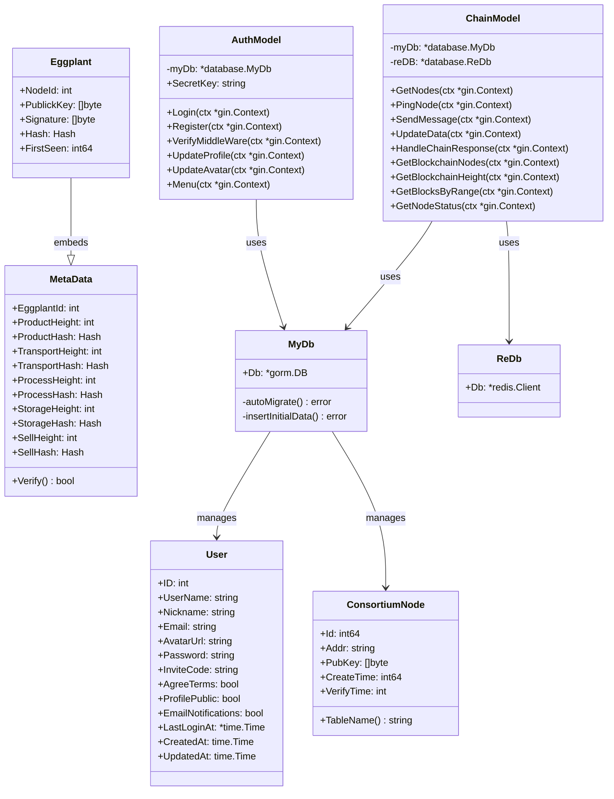
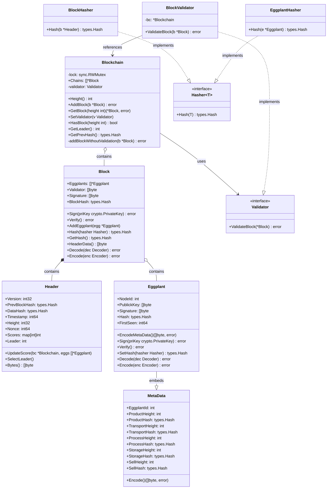
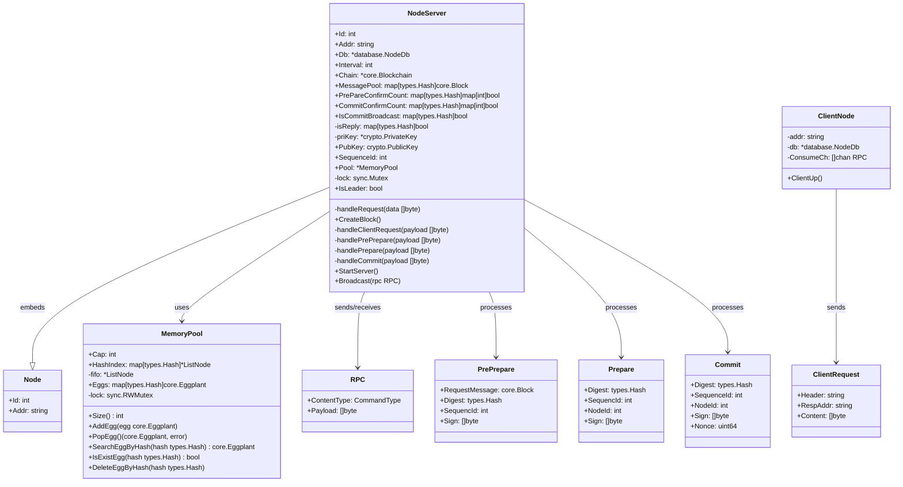
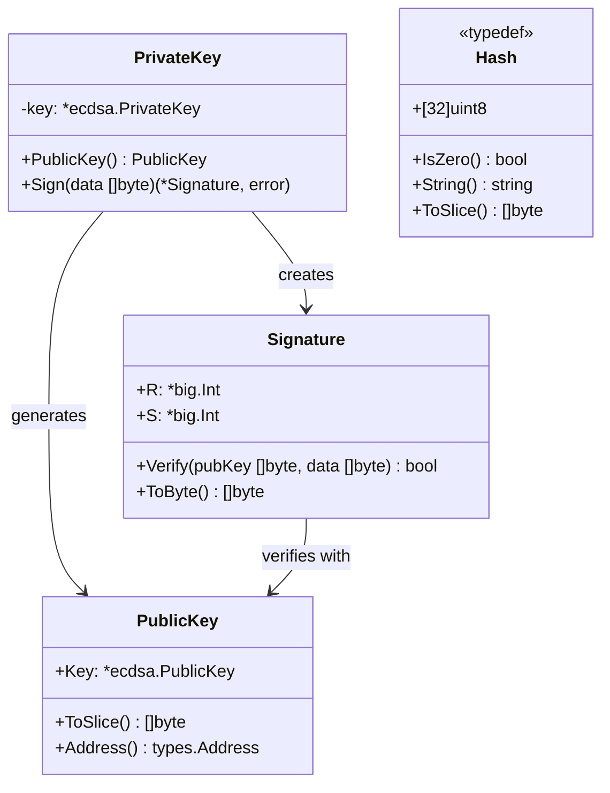
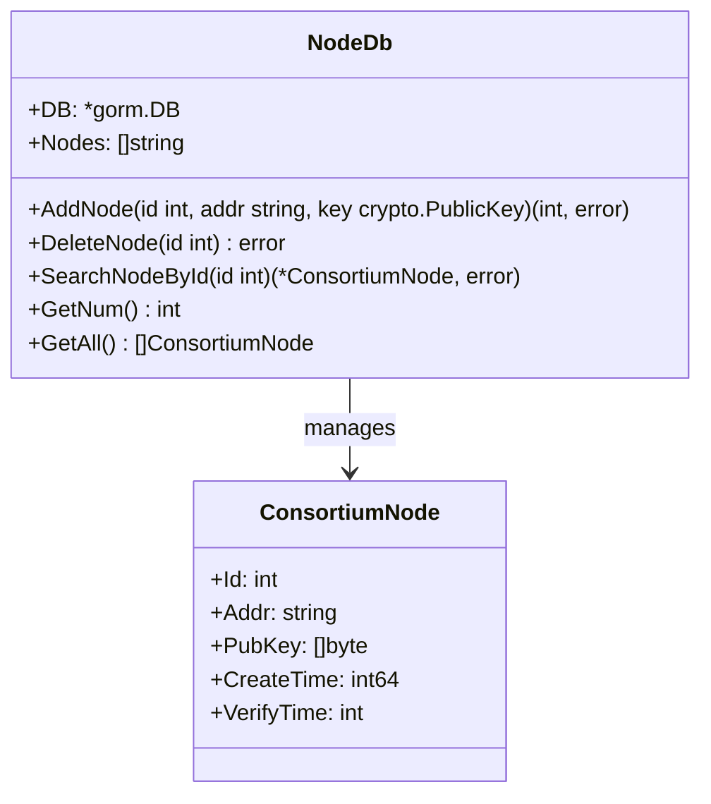

# 农产品溯源系统 - 后端设计文档

## 目录
1. [系统概述](#系统概述)
2. [模块划分](#模块划分)
3. [类图描述](#类图描述)
4. [类图 (Mermaid)](#类图-mermaid)

---

## 系统概述

本系统是一个基于区块链的农产品溯源系统，采用 Go 语言开发，主要包含两个核心模块：
- **控制系统 (control_system)**：提供 RESTful API 接口，负责用户认证、数据管理和与区块链节点的交互
- **区块链系统 (trace_of_product)**：实现 PBFT 共识机制的联盟链节点，负责数据上链和验证

---

## 模块划分

### 1. 控制系统模块 (control_system)
| 包名 | 功能描述 |
|------|----------|
| `controller` | HTTP 请求处理器，包含认证和链交互 |
| `models` | 数据模型定义 |
| `database` | 数据库连接和操作 |
| `utils` | 工具函数 |

### 2. 区块链系统模块 (trace_of_product)
| 包名 | 功能描述 |
|------|----------|
| `core` | 区块链核心逻辑（区块、链、茄子数据） |
| `crypto` | 加密算法（ECDSA 签名验签） |
| `network` | 网络层（PBFT 共识、TCP 传输） |
| `database` | 节点数据库操作 |
| `types` | 基础类型定义 |

---

## 类图描述

### 一、控制系统 (control_system)

#### 1.1 AuthModel（认证模型）
| 属性/方法 | 类型 | 可见性 | 描述 |
|-----------|------|--------|------|
| `myDb` | `*database.MyDb` | 私有 | 数据库连接 |
| `SecretKey` | `string` | 公有 | JWT 密钥 |
| `Login(ctx *gin.Context)` | 方法 | 公有 | 用户登录 |
| `Register(ctx *gin.Context)` | 方法 | 公有 | 用户注册 |
| `VerifyMiddleWare(ctx *gin.Context)` | 方法 | 公有 | JWT 验证中间件 |
| `UpdateProfile(ctx *gin.Context)` | 方法 | 公有 | 更新用户资料 |
| `UpdateAvatar(ctx *gin.Context)` | 方法 | 公有 | 更新用户头像 |
| `Menu(ctx *gin.Context)` | 方法 | 公有 | 菜单接口 |

#### 1.2 ChainModel（链交互模型）
| 属性/方法 | 类型 | 可见性 | 描述 |
|-----------|------|--------|------|
| `myDb` | `*database.MyDb` | 私有 | PostgreSQL 数据库 |
| `reDB` | `*database.ReDb` | 私有 | Redis 数据库 |
| `GetNodes(ctx *gin.Context)` | 方法 | 公有 | 获取节点列表 |
| `PingNode(ctx *gin.Context)` | 方法 | 公有 | 测试节点连接 |
| `SendMessage(ctx *gin.Context)` | 方法 | 公有 | 发送查询消息 |
| `UpdateData(ctx *gin.Context)` | 方法 | 公有 | 上传数据到链 |
| `HandleChainResponse(ctx *gin.Context)` | 方法 | 公有 | 处理链响应 |
| `GetBlockchainNodes(ctx *gin.Context)` | 方法 | 公有 | 获取区块链节点 |
| `GetBlockchainHeight(ctx *gin.Context)` | 方法 | 公有 | 获取链高度 |
| `GetBlocksByRange(ctx *gin.Context)` | 方法 | 公有 | 按范围获取区块 |
| `GetNodeStatus(ctx *gin.Context)` | 方法 | 公有 | 获取节点状态 |

#### 1.3 User（用户模型）
| 属性 | 类型 | 可见性 | 描述 |
|------|------|--------|------|
| `ID` | `int` | 公有 | 用户ID（主键） |
| `UserName` | `string` | 公有 | 用户名（唯一） |
| `Nickname` | `string` | 公有 | 昵称 |
| `Email` | `string` | 公有 | 邮箱（唯一） |
| `AvatarUrl` | `string` | 公有 | 头像URL |
| `Password` | `string` | 公有 | 密码 |
| `InviteCode` | `string` | 公有 | 邀请码 |
| `AgreeTerms` | `bool` | 公有 | 同意条款 |
| `ProfilePublic` | `bool` | 公有 | 资料公开 |
| `EmailNotifications` | `bool` | 公有 | 邮件通知 |
| `LastLoginAt` | `*time.Time` | 公有 | 最后登录时间 |
| `CreatedAt` | `time.Time` | 公有 | 创建时间 |
| `UpdatedAt` | `time.Time` | 公有 | 更新时间 |

#### 1.4 ConsortiumNode（联盟链节点模型）
| 属性 | 类型 | 可见性 | 描述 |
|------|------|--------|------|
| `Id` | `int64` | 公有 | 节点ID（主键） |
| `Addr` | `string` | 公有 | 节点地址 |
| `PubKey` | `[]byte` | 公有 | 节点公钥 |
| `CreateTime` | `int64` | 公有 | 创建时间戳 |
| `VerifyTime` | `int` | 公有 | 验证时间 |
| `TableName()` | 方法 | 公有 | 返回表名 |

#### 1.5 MetaData（元数据模型）
| 属性 | 类型 | 可见性 | 描述 |
|------|------|--------|------|
| `EggplantId` | `int` | 公有 | 茄子ID |
| `ProductHeight` | `int` | 公有 | 生产区块高度 |
| `ProductHash` | `Hash` | 公有 | 生产哈希 |
| `TransportHeight` | `int` | 公有 | 运输区块高度 |
| `TransportHash` | `Hash` | 公有 | 运输哈希 |
| `ProcessHeight` | `int` | 公有 | 加工区块高度 |
| `ProcessHash` | `Hash` | 公有 | 加工哈希 |
| `StorageHeight` | `int` | 公有 | 存储区块高度 |
| `StorageHash` | `Hash` | 公有 | 存储哈希 |
| `SellHeight` | `int` | 公有 | 销售区块高度 |
| `SellHash` | `Hash` | 公有 | 销售哈希 |
| `Verify()` | 方法 | 公有 | 验证元数据 |

#### 1.6 MyDb（数据库封装）
| 属性/方法 | 类型 | 可见性 | 描述 |
|-----------|------|--------|------|
| `Db` | `*gorm.DB` | 公有 | GORM 数据库实例 |
| `autoMigrate()` | 方法 | 私有 | 自动迁移表结构 |
| `insertInitialData()` | 方法 | 私有 | 插入初始数据 |

---

### 二、区块链系统 (trace_of_product)

#### 2.1 Block（区块）
| 属性/方法 | 类型 | 可见性 | 描述 |
|-----------|------|--------|------|
| `*Header` | `*Header` | 公有（嵌入） | 区块头 |
| `Eggplants` | `[]*Eggplant` | 公有 | 茄子数据列表 |
| `Validator` | `[]byte` | 公有 | 验证者公钥 |
| `Signature` | `[]byte` | 公有 | 区块签名 |
| `BlockHash` | `types.Hash` | 公有 | 区块哈希 |
| `Sign(priKey crypto.PrivateKey)` | 方法 | 公有 | 签名区块 |
| `Verify()` | 方法 | 公有 | 验证区块 |
| `AddEggplant(egg *Eggplant)` | 方法 | 公有 | 添加茄子数据 |
| `Hash(hasher Hasher[*Header])` | 方法 | 公有 | 计算区块哈希 |
| `GetHash()` | 方法 | 公有 | 获取区块哈希 |
| `HeaderData()` | 方法 | 公有 | 获取头部数据 |
| `Decode(dec Decoder[*Block])` | 方法 | 公有 | 解码区块 |
| `Encode(enc Encoder[*Block])` | 方法 | 公有 | 编码区块 |

#### 2.2 Header（区块头）
| 属性/方法 | 类型 | 可见性 | 描述 |
|-----------|------|--------|------|
| `Version` | `int32` | 公有 | 版本号 |
| `PrevBlockHash` | `types.Hash` | 公有 | 前一区块哈希 |
| `DataHash` | `types.Hash` | 公有 | 数据哈希 |
| `Timestamp` | `int64` | 公有 | 时间戳 |
| `Height` | `int32` | 公有 | 区块高度 |
| `Nonce` | `int64` | 公有 | 随机数 |
| `Scores` | `map[int]int` | 公有 | 节点积分 |
| `Leader` | `int` | 公有 | 领导者ID |
| `UpdateScore(bc *Blockchain, eggs []*Eggplant)` | 方法 | 公有 | 更新积分 |
| `SelectLeader()` | 方法 | 公有 | 选举领导者 |
| `Bytes()` | 方法 | 公有 | 序列化为字节 |

#### 2.3 Blockchain（区块链）
| 属性/方法 | 类型 | 可见性 | 描述 |
|-----------|------|--------|------|
| `lock` | `sync.RWMutex` | 私有 | 读写锁 |
| `Chains` | `[]*Block` | 公有 | 区块链 |
| `validator` | `Validator` | 私有 | 验证器 |
| `Height()` | 方法 | 公有 | 获取链高度 |
| `AddBlock(b *Block)` | 方法 | 公有 | 添加区块 |
| `GetBlock(height int)` | 方法 | 公有 | 获取指定高度区块 |
| `SetValidator(v Validator)` | 方法 | 公有 | 设置验证器 |
| `HasBlock(height int)` | 方法 | 公有 | 检查区块是否存在 |
| `GetLeader()` | 方法 | 公有 | 获取当前领导者 |
| `GetPrevHash()` | 方法 | 公有 | 获取前一区块哈希 |
| `addBlockWithoutValidation(b *Block)` | 方法 | 私有 | 无验证添加区块 |

#### 2.4 Eggplant（茄子数据实体）
| 属性/方法 | 类型 | 可见性 | 描述 |
|-----------|------|--------|------|
| `MetaData` | `MetaData` | 公有（嵌入） | 元数据 |
| `NodeId` | `int` | 公有 | 节点ID |
| `PublickKey` | `[]byte` | 公有 | 验证者公钥 |
| `Signature` | `[]byte` | 公有 | 签名 |
| `Hash` | `types.Hash` | 公有 | 哈希值 |
| `FirstSeen` | `int64` | 公有 | 首次出现时间 |
| `EncodeMetaData()` | 方法 | 公有 | 编码元数据 |
| `Sign(priKey crypto.PrivateKey)` | 方法 | 公有 | 签名数据 |
| `Verify()` | 方法 | 公有 | 验证签名 |
| `SetHash(hasher Hasher[*Eggplant])` | 方法 | 公有 | 设置哈希 |
| `Decode(dec Decoder[*Eggplant])` | 方法 | 公有 | 解码 |
| `Encode(enc Encoder[*Eggplant])` | 方法 | 公有 | 编码 |

#### 2.5 NodeServer（节点服务器）
| 属性/方法 | 类型 | 可见性 | 描述 |
|-----------|------|--------|------|
| `Node` | `Node` | 公有（嵌入） | 节点基础信息 |
| `Db` | `*database.NodeDb` | 公有 | 数据库连接 |
| `Interval` | `int` | 公有 | 出块间隔 |
| `Chain` | `*core.Blockchain` | 公有 | 区块链实例 |
| `MessagePool` | `map[types.Hash]core.Block` | 公有 | 消息池 |
| `PrePareConfirmCount` | `map[types.Hash]map[int]bool` | 公有 | Prepare 确认计数 |
| `CommitConfirmCount` | `map[types.Hash]map[int]bool` | 公有 | Commit 确认计数 |
| `IsCommitBroadcast` | `map[types.Hash]bool` | 公有 | 是否已广播 Commit |
| `isReply` | `map[types.Hash]bool` | 私有 | 是否已回复 |
| `priKey` | `*crypto.PrivateKey` | 私有 | 私钥 |
| `PubKey` | `crypto.PublicKey` | 公有 | 公钥 |
| `SequenceId` | `int` | 公有 | 序列号 |
| `Pool` | `*MemoryPool` | 公有 | 内存池 |
| `lock` | `sync.Mutex` | 私有 | 互斥锁 |
| `IsLeader` | `bool` | 公有 | 是否为领导者 |
| `handleRequest(data []byte)` | 方法 | 私有 | 处理请求 |
| `CreateBlock()` | 方法 | 公有 | 创建区块 |
| `handleClientRequest(payload []byte)` | 方法 | 私有 | 处理客户端请求 |
| `handlePrePrepare(payload []byte)` | 方法 | 私有 | 处理 PrePrepare |
| `handlePrepare(payload []byte)` | 方法 | 私有 | 处理 Prepare |
| `handleCommit(payload []byte)` | 方法 | 私有 | 处理 Commit |
| `StartServer()` | 方法 | 公有 | 启动服务器 |
| `Broadcast(rpc RPC)` | 方法 | 公有 | 广播消息 |

#### 2.6 MemoryPool（内存池）
| 属性/方法 | 类型 | 可见性 | 描述 |
|-----------|------|--------|------|
| `Cap` | `int` | 公有 | 容量上限 |
| `HashIndex` | `map[types.Hash]*ListNode` | 公有 | 哈希索引 |
| `fifo` | `*ListNode` | 私有 | FIFO 链表头 |
| `Eggs` | `map[types.Hash]core.Eggplant` | 公有 | 茄子数据映射 |
| `lock` | `sync.RWMutex` | 私有 | 读写锁 |
| `Size()` | 方法 | 公有 | 获取大小 |
| `AddEgg(egg core.Eggplant)` | 方法 | 公有 | 添加茄子数据 |
| `PopEgg()` | 方法 | 公有 | 弹出茄子数据 |
| `SearchEggByHash(hash types.Hash)` | 方法 | 公有 | 按哈希搜索 |
| `IsExistEgg(hash types.Hash)` | 方法 | 公有 | 检查是否存在 |
| `DeleteEggByHash(hash types.Hash)` | 方法 | 公有 | 按哈希删除 |

#### 2.7 PrivateKey（私钥）
| 属性/方法 | 类型 | 可见性 | 描述 |
|-----------|------|--------|------|
| `key` | `*ecdsa.PrivateKey` | 私有 | ECDSA 私钥 |
| `PublicKey()` | 方法 | 公有 | 获取公钥 |
| `Sign(data []byte)` | 方法 | 公有 | 签名数据 |

#### 2.8 PublicKey（公钥）
| 属性/方法 | 类型 | 可见性 | 描述 |
|-----------|------|--------|------|
| `Key` | `*ecdsa.PublicKey` | 公有 | ECDSA 公钥 |
| `ToSlice()` | 方法 | 公有 | 转换为字节切片 |
| `Address()` | 方法 | 公有 | 获取地址 |

#### 2.9 Signature（签名）
| 属性/方法 | 类型 | 可见性 | 描述 |
|-----------|------|--------|------|
| `R` | `*big.Int` | 公有 | 签名 R 值 |
| `S` | `*big.Int` | 公有 | 签名 S 值 |
| `Verify(pubKey []byte, data []byte)` | 方法 | 公有 | 验证签名 |
| `ToByte()` | 方法 | 公有 | 转换为字节 |

#### 2.10 Hash（哈希类型）
| 属性/方法 | 类型 | 可见性 | 描述 |
|-----------|------|--------|------|
| `[32]uint8` | 数组 | - | 32 字节哈希值 |
| `IsZero()` | 方法 | 公有 | 检查是否为零 |
| `String()` | 方法 | 公有 | 转换为十六进制字符串 |
| `ToSlice()` | 方法 | 公有 | 转换为字节切片 |

#### 2.11 Validator（验证器接口）
| 方法 | 类型 | 可见性 | 描述 |
|------|------|--------|------|
| `ValidateBlock(*Block)` | 接口方法 | 公有 | 验证区块 |

#### 2.12 BlockValidator（区块验证器）
| 属性/方法 | 类型 | 可见性 | 描述 |
|-----------|------|--------|------|
| `bc` | `*Blockchain` | 私有 | 区块链引用 |
| `ValidateBlock(b *Block)` | 方法 | 公有 | 验证区块合法性 |

#### 2.13 PBFT 消息类型

##### PrePrepare（预准备消息）
| 属性 | 类型 | 可见性 | 描述 |
|------|------|--------|------|
| `RequestMessage` | `core.Block` | 公有 | 请求的区块 |
| `Digest` | `types.Hash` | 公有 | 消息摘要 |
| `SequencId` | `int` | 公有 | 序列号 |
| `Sign` | `[]byte` | 公有 | 签名 |

##### Prepare（准备消息）
| 属性 | 类型 | 可见性 | 描述 |
|------|------|--------|------|
| `Digest` | `types.Hash` | 公有 | 消息摘要 |
| `SequencId` | `int` | 公有 | 序列号 |
| `NodeId` | `int` | 公有 | 节点ID |
| `Sign` | `[]byte` | 公有 | 签名 |

##### Commit（提交消息）
| 属性 | 类型 | 可见性 | 描述 |
|------|------|--------|------|
| `Digest` | `types.Hash` | 公有 | 消息摘要 |
| `SequenceId` | `int` | 公有 | 序列号 |
| `NodeId` | `int` | 公有 | 节点ID |
| `Sign` | `[]byte` | 公有 | 签名 |
| `Nonce` | `uint64` | 公有 | 随机数 |

#### 2.14 RPC（远程过程调用）
| 属性 | 类型 | 可见性 | 描述 |
|------|------|--------|------|
| `ContentType` | `CommandType` | 公有 | 命令类型 |
| `Payload` | `[]byte` | 公有 | 负载数据 |

#### 2.15 ClientRequest（客户端请求）
| 属性 | 类型 | 可见性 | 描述 |
|------|------|--------|------|
| `Header` | `string` | 公有 | 请求头（Upload/Search） |
| `RespAddr` | `string` | 公有 | 响应地址 |
| `Content` | `[]byte` | 公有 | 请求内容 |

#### 2.16 NodeDb（节点数据库）
| 属性/方法 | 类型 | 可见性 | 描述 |
|-----------|------|--------|------|
| `DB` | `*gorm.DB` | 公有 | GORM 数据库实例 |
| `Nodes` | `[]string` | 公有 | 节点列表 |
| `AddNode(id int, addr string, key crypto.PublicKey)` | 方法 | 公有 | 添加节点 |
| `DeleteNode(id int)` | 方法 | 公有 | 删除节点 |
| `SearchNodeById(id int)` | 方法 | 公有 | 按ID搜索节点 |
| `GetNum()` | 方法 | 公有 | 获取节点数量 |
| `GetAll()` | 方法 | 公有 | 获取所有节点 |

#### 2.17 编码器/解码器接口

##### Encoder[T any]（编码器泛型接口）
| 方法 | 类型 | 可见性 | 描述 |
|------|------|--------|------|
| `Encode(T)` | 接口方法 | 公有 | 编码对象 |

##### Decoder[T any]（解码器泛型接口）
| 方法 | 类型 | 可见性 | 描述 |
|------|------|--------|------|
| `Decode(T)` | 接口方法 | 公有 | 解码对象 |

##### Hasher[T any]（哈希器泛型接口）
| 方法 | 类型 | 可见性 | 描述 |
|------|------|--------|------|
| `Hash(T)` | 接口方法 | 公有 | 计算哈希值 |

---

## 类图 (Mermaid)

### 控制系统类图



### 区块链核心类图



### 网络层类图



### 加密模块类图



### 数据库模块类图



---

## 系统架构

### 架构描述

本系统采用**三层架构**设计，分为表示层、业务逻辑层和数据层：

#### 1. 表示层（Presentation Layer）
- **前端应用**：基于 Vue.js 3 构建的单页应用（SPA）
- **技术栈**：Vue 3 + Vite + Pinia + Vue Router
- **职责**：用户界面展示、用户交互、数据可视化

#### 2. 业务逻辑层（Business Logic Layer）
- **控制系统（control_system）**：
  - 基于 Gin 框架的 RESTful API 服务
  - 负责用户认证、权限管理、请求路由
  - 作为前端与区块链网络之间的桥梁
  
- **区块链网络（trace_of_product）**：
  - 基于 PBFT 共识算法的联盟链节点集群
  - 负责数据上链、共识达成、数据验证
  - 支持多节点分布式部署

#### 3. 数据层（Data Layer）
- **PostgreSQL**：关系型数据库，存储用户信息、节点信息
- **Redis**：缓存数据库，存储查询结果、会话信息
- **区块链存储**：内存中的区块链数据结构

### 架构图

```
┌─────────────────────────────────────────────────────────────────────────────┐
│                              表示层 (Presentation)                           │
│  ┌───────────────────────────────────────────────────────────────────────┐  │
│  │                        Vue.js 3 前端应用                               │  │
│  │  ┌─────────────┐ ┌─────────────┐ ┌─────────────┐ ┌─────────────┐     │  │
│  │  │  登录/注册   │ │  数据上传   │ │  数据查询   │ │  节点管理   │     │  │
│  │  └─────────────┘ └─────────────┘ └─────────────┘ └─────────────┘     │  │
│  └───────────────────────────────────────────────────────────────────────┘  │
└─────────────────────────────────────────────────────────────────────────────┘
                                      │ HTTP/REST
                                      ▼
┌─────────────────────────────────────────────────────────────────────────────┐
│                            业务逻辑层 (Business Logic)                       │
│  ┌───────────────────────────────────────────────────────────────────────┐  │
│  │                    控制系统 (control_system)                           │  │
│  │  ┌─────────────────────────┐   ┌─────────────────────────┐           │  │
│  │  │      AuthModel          │   │      ChainModel         │           │  │
│  │  │  · Login()              │   │  · GetNodes()           │           │  │
│  │  │  · Register()           │   │  · UpdateData()         │           │  │
│  │  │  · VerifyMiddleWare()   │   │  · SendMessage()        │           │  │
│  │  │  · UpdateProfile()      │   │  · HandleChainResponse()│           │  │
│  │  └─────────────────────────┘   └─────────────────────────┘           │  │
│  └───────────────────────────────────────────────────────────────────────┘  │
│                                      │ TCP                                   │
│                                      ▼                                       │
│  ┌───────────────────────────────────────────────────────────────────────┐  │
│  │                    区块链网络 (trace_of_product)                       │  │
│  │                                                                        │  │
│  │    ┌──────────┐    ┌──────────┐    ┌──────────┐    ┌──────────┐      │  │
│  │    │  Node 1  │◄──►│  Node 2  │◄──►│  Node 3  │◄──►│  Node 4  │      │  │
│  │    │ (Leader) │    │          │    │          │    │          │      │  │
│  │    └────┬─────┘    └────┬─────┘    └────┬─────┘    └────┬─────┘      │  │
│  │         │               │               │               │             │  │
│  │         └───────────────┴───────────────┴───────────────┘             │  │
│  │                              │ PBFT 共识                               │  │
│  │                              ▼                                         │  │
│  │    ┌─────────────────────────────────────────────────────────────┐   │  │
│  │    │                      Blockchain                              │   │  │
│  │    │  Block 0 ──► Block 1 ──► Block 2 ──► ... ──► Block N       │   │  │
│  │    └─────────────────────────────────────────────────────────────┘   │  │
│  └───────────────────────────────────────────────────────────────────────┘  │
└─────────────────────────────────────────────────────────────────────────────┘
                                      │
                                      ▼
┌─────────────────────────────────────────────────────────────────────────────┐
│                              数据层 (Data)                                   │
│  ┌─────────────────────┐  ┌─────────────────────┐  ┌───────────────────┐   │
│  │     PostgreSQL      │  │       Redis         │  │  Blockchain Store │   │
│  │  · users            │  │  · 查询缓存          │  │  · Blocks[]       │   │
│  │  · consortium_nodes │  │  · 会话信息          │  │  · MemoryPool     │   │
│  └─────────────────────┘  └─────────────────────┘  └───────────────────┘   │
└─────────────────────────────────────────────────────────────────────────────┘
```

### 组件交互图

```
┌──────────┐      ┌──────────┐      ┌──────────┐      ┌──────────┐
│  Client  │      │   API    │      │  Chain   │      │  Nodes   │
│ (Vue.js) │      │  Server  │      │  Model   │      │  (PBFT)  │
└────┬─────┘      └────┬─────┘      └────┬─────┘      └────┬─────┘
     │                 │                 │                 │
     │   HTTP POST     │                 │                 │
     │   /upload       │                 │                 │
     │────────────────►│                 │                 │
     │                 │                 │                 │
     │                 │  UpdateData()   │                 │
     │                 │────────────────►│                 │
     │                 │                 │                 │
     │                 │                 │   TCP Request   │
     │                 │                 │────────────────►│
     │                 │                 │                 │
     │                 │                 │                 │  ┌─────────┐
     │                 │                 │                 │──│ PBFT    │
     │                 │                 │                 │  │ 共识    │
     │                 │                 │                 │◄─│ 过程    │
     │                 │                 │                 │  └─────────┘
     │                 │                 │                 │
     │                 │                 │   HTTP POST     │
     │                 │                 │◄────────────────│
     │                 │                 │  /meta_data     │
     │                 │                 │                 │
     │                 │  Response       │                 │
     │                 │◄────────────────│                 │
     │                 │                 │                 │
     │   JSON Response │                 │                 │
     │◄────────────────│                 │                 │
     │                 │                 │                 │
```

---

## 时序图

### 1. 用户登录时序图

```
┌──────┐          ┌──────────┐          ┌──────────┐          ┌────────────┐
│Client│          │Gin Router│          │AuthModel │          │ PostgreSQL │
└──┬───┘          └────┬─────┘          └────┬─────┘          └─────┬──────┘
   │                   │                     │                      │
   │ POST /login       │                     │                      │
   │ {username,password}                     │                      │
   │──────────────────►│                     │                      │
   │                   │                     │                      │
   │                   │ Login(ctx)          │                      │
   │                   │────────────────────►│                      │
   │                   │                     │                      │
   │                   │                     │ SELECT * FROM users  │
   │                   │                     │ WHERE user_name=?    │
   │                   │                     │─────────────────────►│
   │                   │                     │                      │
   │                   │                     │    User Record       │
   │                   │                     │◄─────────────────────│
   │                   │                     │                      │
   │                   │                     │ 验证密码              │
   │                   │                     │ 生成 JWT Token       │
   │                   │                     │                      │
   │                   │ {token, user_info}  │                      │
   │                   │◄────────────────────│                      │
   │                   │                     │                      │
   │ 200 OK            │                     │                      │
   │ {success, token}  │                     │                      │
   │◄──────────────────│                     │                      │
   │                   │                     │                      │
```

### 2. 用户注册时序图

```
┌──────┐          ┌──────────┐          ┌──────────┐          ┌────────────┐
│Client│          │Gin Router│          │AuthModel │          │ PostgreSQL │
└──┬───┘          └────┬─────┘          └────┬─────┘          └─────┬──────┘
   │                   │                     │                      │
   │ POST /register    │                     │                      │
   │ {username,email,  │                     │                      │
   │  password,...}    │                     │                      │
   │──────────────────►│                     │                      │
   │                   │                     │                      │
   │                   │ Register(ctx)       │                      │
   │                   │────────────────────►│                      │
   │                   │                     │                      │
   │                   │                     │ 检查用户名是否存在    │
   │                   │                     │─────────────────────►│
   │                   │                     │◄─────────────────────│
   │                   │                     │                      │
   │                   │                     │ 检查邮箱是否存在      │
   │                   │                     │─────────────────────►│
   │                   │                     │◄─────────────────────│
   │                   │                     │                      │
   │                   │                     │ INSERT INTO users    │
   │                   │                     │─────────────────────►│
   │                   │                     │◄─────────────────────│
   │                   │                     │                      │
   │                   │ {success, user_id}  │                      │
   │                   │◄────────────────────│                      │
   │                   │                     │                      │
   │ 200 OK            │                     │                      │
   │◄──────────────────│                     │                      │
```

### 3. 数据上传时序图

```
┌──────┐       ┌──────────┐      ┌──────────┐      ┌──────────┐      ┌─────────┐
│Client│       │Gin Router│      │ChainModel│      │NodeServer│      │MemPool  │
└──┬───┘       └────┬─────┘      └────┬─────┘      └────┬─────┘      └────┬────┘
   │                │                 │                 │                 │
   │ POST /upload   │                 │                 │                 │
   │ + JWT Token    │                 │                 │                 │
   │───────────────►│                 │                 │                 │
   │                │                 │                 │                 │
   │                │VerifyMiddleWare │                 │                 │
   │                │────────┐        │                 │                 │
   │                │        │验证JWT │                 │                 │
   │                │◄───────┘        │                 │                 │
   │                │                 │                 │                 │
   │                │ UpdateData(ctx) │                 │                 │
   │                │────────────────►│                 │                 │
   │                │                 │                 │                 │
   │                │                 │ 构建 Eggplant   │                 │
   │                │                 │ 编码为 RPC      │                 │
   │                │                 │                 │                 │
   │                │                 │ TCP: RPC{Upload}│                 │
   │                │                 │────────────────►│                 │
   │                │                 │                 │                 │
   │                │                 │                 │handleClientReq  │
   │                │                 │                 │────────┐        │
   │                │                 │                 │        │解码    │
   │                │                 │                 │        │签名    │
   │                │                 │                 │◄───────┘        │
   │                │                 │                 │                 │
   │                │                 │                 │ AddEgg(egg)     │
   │                │                 │                 │────────────────►│
   │                │                 │                 │                 │
   │                │                 │                 │ 广播到其他节点  │
   │                │                 │                 │─────────────────│──►
   │                │                 │                 │                 │
   │                │ {status: ok}    │                 │                 │
   │                │◄────────────────│                 │                 │
   │                │                 │                 │                 │
   │ 200 OK         │                 │                 │                 │
   │◄───────────────│                 │                 │                 │
```

### 4. 数据查询时序图

```
┌──────┐       ┌──────────┐      ┌──────────┐      ┌─────┐      ┌──────────┐
│Client│       │Gin Router│      │ChainModel│      │Redis│      │NodeServer│
└──┬───┘       └────┬─────┘      └────┬─────┘      └──┬──┘      └────┬─────┘
   │                │                 │               │               │
   │ GET /query     │                 │               │               │
   │ ?id=xxx        │                 │               │               │
   │───────────────►│                 │               │               │
   │                │                 │               │               │
   │                │ SendMessage(ctx)│               │               │
   │                │────────────────►│               │               │
   │                │                 │               │               │
   │                │                 │ EXISTS(id)    │               │
   │                │                 │──────────────►│               │
   │                │                 │               │               │
   │                │                 │ 0 (不存在)    │               │
   │                │                 │◄──────────────│               │
   │                │                 │               │               │
   │                │                 │ TCP: Search   │               │
   │                │                 │──────────────────────────────►│
   │                │                 │               │               │
   │                │                 │               │   遍历区块链  │
   │                │                 │               │   查找数据    │
   │                │                 │               │               │
   │                │                 │ HTTP: /meta_data              │
   │                │                 │◄──────────────────────────────│
   │                │                 │               │               │
   │                │                 │ SET(id, data) │               │
   │                │                 │──────────────►│               │
   │                │                 │               │               │
   │                │ {msg: data}     │               │               │
   │                │◄────────────────│               │               │
   │                │                 │               │               │
   │ 200 OK         │                 │               │               │
   │◄───────────────│                 │               │               │
```

### 5. PBFT 共识时序图

```
┌────────┐      ┌────────┐      ┌────────┐      ┌────────┐
│ Leader │      │ Node 2 │      │ Node 3 │      │ Node 4 │
│(Node 1)│      │        │      │        │      │        │
└───┬────┘      └───┬────┘      └───┬────┘      └───┬────┘
    │               │               │               │
    │ CreateBlock() │               │               │
    │───────┐       │               │               │
    │       │       │               │               │
    │◄──────┘       │               │               │
    │               │               │               │
    │═══════════════════════════════════════════════│
    │           Phase 1: Pre-Prepare                │
    │═══════════════════════════════════════════════│
    │               │               │               │
    │ PrePrepare    │               │               │
    │──────────────►│               │               │
    │ PrePrepare    │               │               │
    │──────────────────────────────►│               │
    │ PrePrepare    │               │               │
    │──────────────────────────────────────────────►│
    │               │               │               │
    │═══════════════════════════════════════════════│
    │           Phase 2: Prepare                    │
    │═══════════════════════════════════════════════│
    │               │               │               │
    │◄──────────────│ Prepare       │               │
    │◄──────────────────────────────│ Prepare       │
    │◄──────────────────────────────────────────────│ Prepare
    │               │               │               │
    │               │◄──────────────│ Prepare       │
    │               │◄──────────────────────────────│ Prepare
    │               │               │               │
    │               │               │◄──────────────│ Prepare
    │               │               │               │
    │═══════════════════════════════════════════════│
    │           Phase 3: Commit                     │
    │═══════════════════════════════════════════════│
    │               │               │               │
    │ Commit        │               │               │
    │──────────────►│               │               │
    │──────────────────────────────►│               │
    │──────────────────────────────────────────────►│
    │               │               │               │
    │◄──────────────│ Commit        │               │
    │◄──────────────────────────────│ Commit        │
    │◄──────────────────────────────────────────────│ Commit
    │               │               │               │
    │═══════════════════════════════════════════════│
    │           Phase 4: Reply (Block Added)        │
    │═══════════════════════════════════════════════│
    │               │               │               │
    │ AddBlock()    │ AddBlock()    │ AddBlock()    │ AddBlock()
    │───────┐       │───────┐       │───────┐       │───────┐
    │       │       │       │       │       │       │       │
    │◄──────┘       │◄──────┘       │◄──────┘       │◄──────┘
    │               │               │               │
```

### 6. 区块创建时序图

```
┌──────────┐      ┌──────────┐      ┌──────────┐      ┌──────────┐
│NodeServer│      │MemoryPool│      │Blockchain│      │  Block   │
└────┬─────┘      └────┬─────┘      └────┬─────┘      └────┬─────┘
     │                 │                 │                 │
     │ CreateBlock()   │                 │                 │
     │────────┐        │                 │                 │
     │        │等待间隔│                 │                 │
     │◄───────┘        │                 │                 │
     │                 │                 │                 │
     │ PopEgg()        │                 │                 │
     │────────────────►│                 │                 │
     │                 │                 │                 │
     │ []Eggplant      │                 │                 │
     │◄────────────────│                 │                 │
     │                 │                 │                 │
     │                 │                 │                 │
     │ GetPrevHash()   │                 │                 │
     │────────────────────────────────►│                  │
     │                 │                 │                 │
     │ prevHash        │                 │                 │
     │◄────────────────────────────────│                  │
     │                 │                 │                 │
     │ 构建 Header     │                 │                 │
     │ UpdateScore()   │                 │                 │
     │ SelectLeader()  │                 │                 │
     │                 │                 │                 │
     │                 │                 │ NewBlock()      │
     │────────────────────────────────────────────────────►│
     │                 │                 │                 │
     │                 │                 │   Block         │
     │◄────────────────────────────────────────────────────│
     │                 │                 │                 │
     │ Sign(priKey)    │                 │                 │
     │────────┐        │                 │                 │
     │        │ECDSA   │                 │                 │
     │◄───────┘        │                 │                 │
     │                 │                 │                 │
     │ 广播 PrePrepare │                 │                 │
     │─────────────────│─────────────────│────────────────►│
     │                 │                 │                 │
```

---

## 协作图（对话图）

### 1. 用户登录协作图

```
                                    ┌─────────────────┐
                                    │   PostgreSQL    │
                                    │    Database     │
                                    └────────▲────────┘
                                             │
                                    4. Query User
                                    5. Return User
                                             │
┌─────────┐    1. POST /login     ┌─────────┴─────────┐
│  Client │ ─────────────────────►│    AuthModel      │
│ (Vue.js)│                       │                   │
└─────────┘◄──────────────────────│  2. Bind JSON     │
            8. Return JWT Token   │  3. Query DB      │
                                  │  6. Verify Passwd │
                                  │  7. Generate JWT  │
                                  └───────────────────┘
```

### 2. 数据上传协作图

```
                        ┌─────────────────┐
                        │   MemoryPool    │
                        │   (内存池)       │
                        └────────▲────────┘
                                 │
                        9. AddEgg(egg)
                                 │
┌─────────┐             ┌────────┴────────┐              ┌─────────────┐
│  Client │ ──1.POST───►│   ChainModel    │ ──5.TCP────► │  NodeServer │
│         │             │                 │              │             │
└─────────┘◄──7.OK──────│  2. Verify JWT  │◄─────────────│ 6.Process   │
                        │  3. Build Egg   │   8.Ack      │ 7.Sign      │
                        │  4. Encode RPC  │              │ 8.Broadcast │
                        └─────────────────┘              └──────┬──────┘
                                                                │
                                                         10. Broadcast
                                                                │
                                    ┌───────────────────────────┼───────────────────────────┐
                                    ▼                           ▼                           ▼
                              ┌──────────┐                ┌──────────┐                ┌──────────┐
                              │  Node 2  │                │  Node 3  │                │  Node 4  │
                              └──────────┘                └──────────┘                └──────────┘
```

### 3. PBFT 共识协作图

```
                                    ┌─────────────────┐
                                    │   Blockchain    │
                                    │  (区块链存储)    │
                                    └────────▲────────┘
                                             │
                                      7. AddBlock
                                             │
┌──────────────────────────────────────────────────────────────────────────────────┐
│                                    PBFT 共识网络                                  │
│                                                                                   │
│     ┌──────────┐                                              ┌──────────┐       │
│     │  Node 1  │──────────1. PrePrepare──────────────────────►│  Node 2  │       │
│     │ (Leader) │◄─────────2. Prepare─────────────────────────│          │       │
│     │          │──────────3. Commit──────────────────────────►│          │       │
│     └────┬─────┘                                              └────┬─────┘       │
│          │                                                         │             │
│    1. PrePrepare                                              2. Prepare         │
│    3. Commit                                                  3. Commit          │
│          │                                                         │             │
│          ▼                                                         ▼             │
│     ┌──────────┐◄────────────2. Prepare────────────────────►┌──────────┐        │
│     │  Node 3  │◄────────────3. Commit─────────────────────►│  Node 4  │        │
│     │          │                                             │          │        │
│     └──────────┘                                             └──────────┘        │
│                                                                                   │
│  消息流向：                                                                        │
│  1. Leader 发送 PrePrepare 到所有节点                                             │
│  2. 各节点互相发送 Prepare 确认                                                    │
│  3. 收到 2f+1 个 Prepare 后发送 Commit                                            │
│  4. 收到 2f+1 个 Commit 后执行区块添加                                             │
│                                                                                   │
└──────────────────────────────────────────────────────────────────────────────────┘
```

### 4. 数据查询协作图

```
┌─────────┐                                                          ┌─────────────┐
│  Client │                                                          │  NodeServer │
│         │──1. GET /query?id=xxx──►┌─────────────┐──5. TCP Search──►│             │
└─────────┘                         │ ChainModel  │                  │ 6. 遍历链    │
     ▲                              │             │◄─7. HTTP POST────│ 查找数据    │
     │                              │ 2. 检查缓存  │    /meta_data    │             │
     │                              │ 3. 未命中    │                  └─────────────┘
     │                              │ 4. 构建请求  │
     │                              │ 8. 缓存结果  │
     │                              └──────┬──────┘
     │                                     │
     │             9. Return Result        │
     └─────────────────────────────────────┘
                                           │
                         ┌─────────────────┼─────────────────┐
                         │                 │                 │
                         ▼                 ▼                 ▼
                   ┌──────────┐      ┌──────────┐      ┌──────────┐
                   │  Redis   │◄────►│PostgreSQL│      │Blockchain│
                   │ (缓存)   │      │ (节点表)  │      │ (数据源) │
                   └──────────┘      └──────────┘      └──────────┘
```

---

## 应用骨架（项目目录结构）

### 完整项目结构

```
trace_of_product/                          # 项目根目录
│
├── api.md                                 # API 文档
├── docker-compose.yml                     # Docker 编排配置（总体）
├── Dockerfile                             # Docker 镜像配置
├── readme.md                              # 项目说明（英文）
├── readme(中文).md                        # 项目说明（中文）
├── start-blockchain.sh                    # 区块链启动脚本
├── 测试报告.md                            # 测试报告文档
│
├── control_system/                        # 控制系统（API 服务器）
│   ├── config.yaml                        # 配置文件
│   ├── config.yaml.example                # 配置文件示例
│   ├── createDatabase.sql                 # 数据库初始化 SQL
│   ├── docker-compose.yml                 # Docker 编排配置
│   ├── Dockerfile                         # Docker 镜像配置
│   ├── go.mod                             # Go 模块定义
│   ├── main.go                            # 程序入口
│   │
│   ├── controller/                        # 控制器层（HTTP 处理器）
│   │   ├── authHandler.go                 # 认证处理器
│   │   │   ├── type AuthModel struct      #   认证模型
│   │   │   ├── func Login()               #   登录
│   │   │   ├── func Register()            #   注册
│   │   │   ├── func VerifyMiddleWare()    #   JWT 验证中间件
│   │   │   ├── func UpdateProfile()       #   更新资料
│   │   │   └── func UpdateAvatar()        #   更新头像
│   │   │
│   │   ├── chainHandler.go                # 链交互处理器
│   │   │   ├── type ChainModel struct     #   链模型
│   │   │   ├── func GetNodes()            #   获取节点
│   │   │   ├── func PingNode()            #   测试节点
│   │   │   ├── func SendMessage()         #   发送消息
│   │   │   ├── func UpdateData()          #   上传数据
│   │   │   └── func HandleChainResponse() #   处理响应
│   │   │
│   │   └── handler_test.go                # 处理器测试
│   │
│   ├── database/                          # 数据库层
│   │   └── create.go                      # 数据库初始化
│   │       ├── type MyDb struct           #   PostgreSQL 封装
│   │       ├── type ReDb struct           #   Redis 封装
│   │       └── func NewMyDb()             #   创建数据库实例
│   │
│   ├── models/                            # 模型层
│   │   └── types.go                       # 类型定义
│   │       ├── type User struct           #   用户模型
│   │       ├── type ConsortiumNode struct #   节点模型
│   │       ├── type MetaData struct       #   元数据模型
│   │       └── type Eggplant struct       #   茄子数据模型
│   │
│   └── utils/                             # 工具函数
│       ├── byte_resolve.go                # 字节处理
│       ├── compare.go                     # 比较函数
│       ├── log.go                         # 日志工具
│       ├── read_config.go                 # 配置读取
│       ├── tcp_connect.go                 # TCP 连接
│       └── utils_test.go                  # 工具测试
│
├── trace_of_product/                      # 区块链系统（节点程序）
│   ├── config.yaml                        # 配置文件
│   ├── docker-compose.yml                 # Docker 编排配置
│   ├── Dockerfile                         # Docker 镜像配置
│   ├── go.mod                             # Go 模块定义
│   ├── main.go                            # 程序入口
│   │
│   ├── core/                              # 核心模块
│   │   ├── block.go                       # 区块
│   │   │   ├── type Header struct         #   区块头
│   │   │   ├── type Block struct          #   区块
│   │   │   ├── func NewBlock()            #   创建区块
│   │   │   ├── func Sign()                #   签名
│   │   │   └── func Verify()              #   验证
│   │   │
│   │   ├── blockchain.go                  # 区块链
│   │   │   ├── type Blockchain struct     #   区块链
│   │   │   ├── func CreateChain()         #   创建链
│   │   │   ├── func AddBlock()            #   添加区块
│   │   │   └── func GetBlock()            #   获取区块
│   │   │
│   │   ├── eggplant.go                    # 茄子数据
│   │   │   ├── type MetaData struct       #   元数据
│   │   │   ├── type Eggplant struct       #   茄子实体
│   │   │   ├── func Sign()                #   签名
│   │   │   └── func Verify()              #   验证
│   │   │
│   │   ├── encoding.go                    # 编解码器
│   │   │   ├── type Encoder interface     #   编码接口
│   │   │   ├── type Decoder interface     #   解码接口
│   │   │   ├── type GobBlockEncoder       #   区块编码器
│   │   │   └── type GobEggplantEncoder    #   茄子编码器
│   │   │
│   │   ├── hasher.go                      # 哈希器
│   │   │   ├── type Hasher interface      #   哈希接口
│   │   │   ├── type BlockHasher           #   区块哈希器
│   │   │   └── type EggplantHasher        #   茄子哈希器
│   │   │
│   │   ├── validator.go                   # 验证器
│   │   │   ├── type Validator interface   #   验证接口
│   │   │   └── type BlockValidator        #   区块验证器
│   │   │
│   │   └── *_test.go                      # 测试文件
│   │
│   ├── crypto/                            # 加密模块
│   │   ├── keypair.go                     # 密钥对
│   │   │   ├── type PrivateKey struct     #   私钥
│   │   │   ├── type PublicKey struct      #   公钥
│   │   │   ├── type Signature struct      #   签名
│   │   │   ├── func GeneratePrivateKey()  #   生成私钥
│   │   │   └── func Sign() / Verify()     #   签名/验签
│   │   │
│   │   ├── key_storage.go                 # 密钥存储
│   │   │   ├── func SaveKey()             #   保存密钥
│   │   │   └── func ReadKey()             #   读取密钥
│   │   │
│   │   └── Keys/                          # 密钥存储目录
│   │       └── {node_id}/                 #   节点密钥目录
│   │           ├── PRI_KEY                #   私钥文件
│   │           └── PUB_KEY                #   公钥文件
│   │
│   ├── network/                           # 网络模块
│   │   ├── node.go                        # 节点服务器
│   │   │   ├── type NodeServer struct     #   节点服务器
│   │   │   ├── func NewNodeServer()       #   创建节点
│   │   │   ├── func StartServer()         #   启动服务
│   │   │   ├── func CreateBlock()         #   创建区块
│   │   │   └── func Broadcast()           #   广播消息
│   │   │
│   │   ├── pbft.go                        # PBFT 共识
│   │   │   ├── type PrePrepare struct     #   预准备消息
│   │   │   ├── type Prepare struct        #   准备消息
│   │   │   ├── type Commit struct         #   提交消息
│   │   │   └── type Reply struct          #   回复消息
│   │   │
│   │   ├── memory_pool.go                 # 内存池
│   │   │   ├── type MemoryPool struct     #   内存池
│   │   │   ├── func AddEgg()              #   添加数据
│   │   │   └── func PopEgg()              #   弹出数据
│   │   │
│   │   ├── rpc.go                         # RPC 定义
│   │   │   ├── type RPC struct            #   RPC 消息
│   │   │   ├── type Message struct        #   消息
│   │   │   └── type ClientRequest struct  #   客户端请求
│   │   │
│   │   ├── tcp_transport.go               # TCP 传输
│   │   │   ├── func tcpDial()             #   TCP 发送
│   │   │   └── func StartServer()         #   TCP 服务
│   │   │
│   │   ├── client.go                      # 客户端
│   │   │   ├── type ClientNode struct     #   客户端节点
│   │   │   └── func ClientUp()            #   启动客户端
│   │   │
│   │   └── *_test.go                      # 测试文件
│   │
│   ├── database/                          # 数据库模块
│   │   ├── create.go                      # 数据库创建
│   │   │   ├── type NodeDb struct         #   节点数据库
│   │   │   ├── func InitNodeDb()          #   初始化
│   │   │   └── func AddNode()             #   添加节点
│   │   │
│   │   └── search.go                      # 数据查询
│   │       ├── func SearchNodeById()      #   按 ID 查询
│   │       └── func GetAll()              #   获取全部
│   │
│   ├── types/                             # 类型模块
│   │   ├── hash.go                        # 哈希类型
│   │   │   ├── type Hash [32]uint8        #   哈希定义
│   │   │   ├── func HashFromBytes()       #   从字节创建
│   │   │   └── func IsZero() / String()   #   工具方法
│   │   │
│   │   └── address.go                     # 地址类型
│   │       └── type Address               #   地址定义
│   │
│   └── utils/                             # 工具模块
│       ├── compare.go                     # 比较函数
│       ├── log.go                         # 日志工具
│       └── read_config.go                 # 配置读取
│
└── front-end/                             # 前端应用 (Vue.js)
    ├── package.json                       # 依赖配置
    ├── vite.config.js                     # Vite 配置
    ├── index.html                         # 入口 HTML
    │
    ├── src/
    │   ├── main.js                        # 应用入口
    │   ├── App.vue                        # 根组件
    │   │
    │   ├── views/                         # 页面视图
    │   │   ├── Login.vue                  #   登录页
    │   │   ├── Register.vue               #   注册页
    │   │   └── Dashboard.vue              #   仪表盘
    │   │
    │   ├── components/                    # 组件
    │   │   ├── LoginForm.vue              #   登录表单
    │   │   ├── RegisterForm.vue           #   注册表单
    │   │   ├── DataUpload.vue             #   数据上传
    │   │   ├── DataQuery.vue              #   数据查询
    │   │   ├── NodeManagement.vue         #   节点管理
    │   │   └── ...                        #   其他组件
    │   │
    │   ├── router/                        # 路由
    │   │   └── index.js                   #   路由配置
    │   │
    │   ├── stores/                        # 状态管理 (Pinia)
    │   │   ├── auth.js                    #   认证状态
    │   │   └── ...                        #   其他状态
    │   │
    │   ├── services/                      # API 服务
    │   │   └── api.js                     #   HTTP 请求
    │   │
    │   └── i18n/                          # 国际化
    │       └── locales/                   #   语言文件
    │
    └── public/                            # 静态资源
        └── avatars/                       #   用户头像
```

### 分层架构骨架

```
┌─────────────────────────────────────────────────────────────────────┐
│                         应用层 (Application Layer)                   │
│  ┌──────────────────────────────────────────────────────────────┐   │
│  │                        main.go (入口)                         │   │
│  │  · 初始化配置                                                  │   │
│  │  · 创建 Gin Engine                                            │   │
│  │  · 注册路由                                                    │   │
│  │  · 启动服务器                                                  │   │
│  └──────────────────────────────────────────────────────────────┘   │
└─────────────────────────────────────────────────────────────────────┘
                                    │
                                    ▼
┌─────────────────────────────────────────────────────────────────────┐
│                         控制层 (Controller Layer)                    │
│  ┌────────────────────────┐  ┌────────────────────────────────┐    │
│  │     authHandler.go     │  │       chainHandler.go          │    │
│  │  · 处理认证请求         │  │  · 处理区块链交互请求           │    │
│  │  · JWT 生成/验证        │  │  · TCP 通信                    │    │
│  │  · 用户管理             │  │  · 数据转发                    │    │
│  └────────────────────────┘  └────────────────────────────────┘    │
└─────────────────────────────────────────────────────────────────────┘
                                    │
                                    ▼
┌─────────────────────────────────────────────────────────────────────┐
│                          模型层 (Model Layer)                        │
│  ┌──────────────────────────────────────────────────────────────┐   │
│  │                         types.go                              │   │
│  │  · User                 用户模型                               │   │
│  │  · ConsortiumNode       节点模型                               │   │
│  │  · MetaData             元数据模型                             │   │
│  │  · Eggplant             茄子数据模型                           │   │
│  │  · ClientRequest        客户端请求模型                         │   │
│  └──────────────────────────────────────────────────────────────┘   │
└─────────────────────────────────────────────────────────────────────┘
                                    │
                                    ▼
┌─────────────────────────────────────────────────────────────────────┐
│                        数据访问层 (Data Access Layer)                │
│  ┌────────────────────────┐  ┌────────────────────────────────┐    │
│  │       MyDb             │  │          ReDb                  │    │
│  │  · PostgreSQL 连接     │  │  · Redis 连接                  │    │
│  │  · GORM ORM            │  │  · 缓存操作                    │    │
│  │  · 自动迁移            │  │  · 过期管理                    │    │
│  └────────────────────────┘  └────────────────────────────────┘    │
└─────────────────────────────────────────────────────────────────────┘
```

---

## 附录：关键常量定义

### 消息类型 (MessageType)
| 常量 | 值 | 描述 |
|------|-----|------|
| `MessageTypeProduce` | 0x1 | 生产消息 |
| `MessageTypeTransport` | 0x2 | 运输消息 |
| `MessageTypeProcess` | 0x3 | 加工消息 |
| `MessageTypeStorage` | 0x4 | 存储消息 |
| `MessageTypeSell` | 0x5 | 销售消息 |
| `MessageTypeBlock` | 0x6 | 区块消息 |
| `MessageTypeEggplant` | 0x7 | 茄子数据消息 |
| `MessageTypeTest` | 0x8 | 测试消息 |

### 命令类型 (CommandType)
| 常量 | 值 | 描述 |
|------|-----|------|
| `cRequest` | "request" | 客户端请求 |
| `cPrePrepare` | "preprepare" | PBFT 预准备 |
| `cPrepare` | "prepare" | PBFT 准备 |
| `cCommit` | "commit" | PBFT 提交 |
| `cReply` | "reply" | 回复 |
| `cEgg` | "egg" | 茄子数据 |
| `cTest` | "test" | 测试 |
